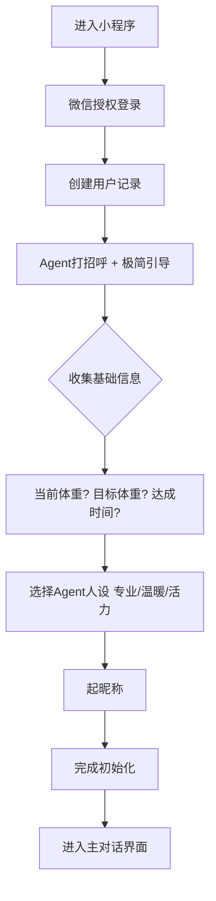
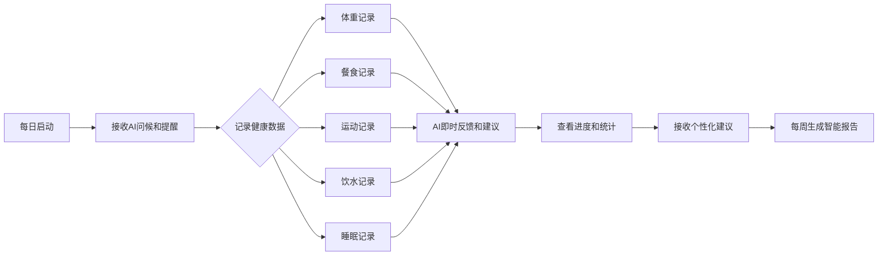
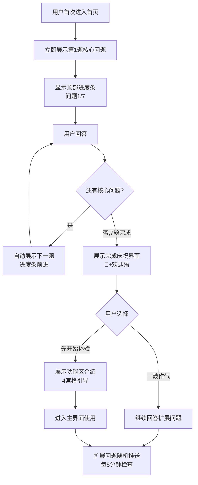
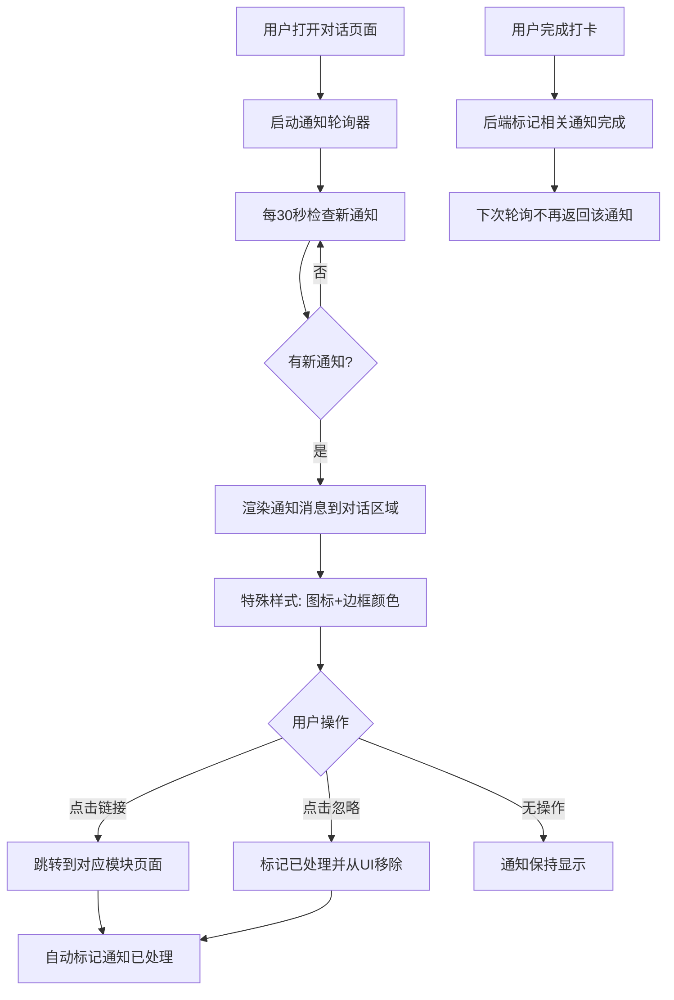
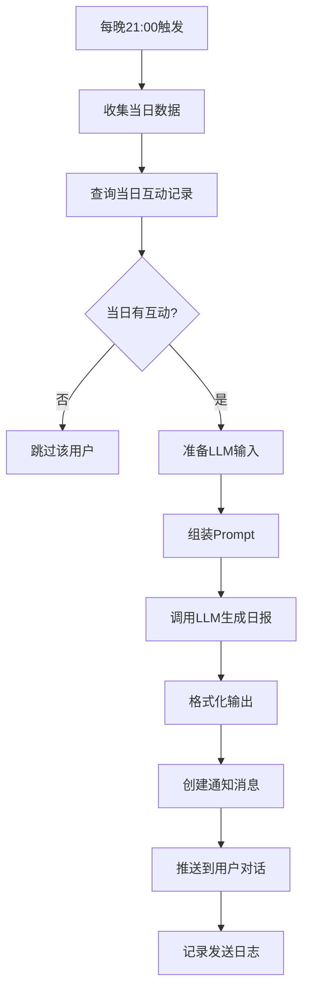

# 体重管理助手 - 产品需求文档（PRD）

**文档版本**: 1.4  
**创建日期**: 2026-02-14  
**更新日期**: 2026-02-19
**状态**: 产品需求文档（技术实现细节已迁移至技术架构文档）  
**功能状态**: ✅ 已实现 | 🔄 待完成/待完善

**版本更新记录**:
- **v1.4** (2026-02-19): 新增智能通知优化模块（第4周），包括用户参与度分析、通知效果评估，最佳时间推荐，内容个性化、A/B测试框架
  - ✅ 日报系统已实现（`services/daily_report_service.py`）
  - ✅ 周报推送系统已实现（`services/report_push_service.py`, `services/report_scheduler.py`）
  - ✅ 通知配置页面支持日报/周报提醒设置
  - ✅ 日报历史API（`/api/report/daily/history`）
- **v1.3** (2026-02-18): 新增通知与报告系统重构（第2-3周）

## 一、产品概述

### 1.1 产品定位
**AI驱动的个性化体重管理伙伴**，通过对话式交互帮助用户科学减重、养成健康习惯。

### 1.2 核心价值主张
1. **深度个性化** - 基于用户画像的1对1长期记忆，像老朋友一样懂你
2. **对话即操作** - 所有功能在对话框内完成，无需跳转页面
3. **智能洞察** - AI发现隐藏模式（睡眠-体重关联、情绪性进食等）
4. **长期陪伴** - 不是工具，是养成习惯的伙伴

### 1.3 竞品对比（薄荷健康）
| 功能维度 | 薄荷健康 | 本产品 |
|---------|---------|--------|
| 记录方式 | 手动输入为主 | AI对话识别 + 手动补充 |
| 个性化 | 通用建议模板 | 基于用户画像的动态个性化 |
| 交互体验 | 功能型App操作 | 陪伴型Agent对话 |
| 数据分析 | 基础统计图表 | AI模式洞察 + 智能建议 |
| 情感支持 | 有限的鼓励机制 | 情感化AI陪伴 + 心理支持 |

## 二、用户角色与画像

### 2.1 核心用户角色

#### 1. **普通用户**
- **特征**: 有减重/体重管理需求的个人用户
- **使用场景**: 
  - 日常体重记录和监控
  - 饮食、运动、饮水、睡眠数据记录
  - 与AI助手对话获取建议和鼓励
  - 查看周报和进度追踪

#### 2. **VIP用户**（商业化扩展）
- **特征**: 付费用户，享受增强功能
- **特权**:
  - 无限AI对话次数
  - 高级AI模式洞察
  - 个性化食谱生成
  - 营养师咨询服务

#### 3. **管理员**（运营后台）
- **特征**: 系统运营人员
- **职责**:
  - 用户管理和数据分析
  - 内容管理（食物库、提示词等）
  - 系统配置和监控
  - 咨询处理（营养师工作台）

#### 4. **营养师**（商业化扩展）
- **特征**: 专业健康顾问
- **功能**:
  - 回答用户专业咨询
  - 查看用户健康档案
  - 提供个性化建议

### 2.2 用户旅程地图

#### **首次使用旅程**


#### **日常使用旅程**


## 三、核心功能模块

### 3.1 用户管理系统

#### **3.1.1 用户注册与登录**
- 🔄 **微信授权登录**: 通过wx.login获取code，后端调用微信API获取openid（模拟实现，待集成）
- ✅ **用户档案创建**: 自动创建基础用户记录和默认Agent配置
- ✅ **Token管理**: JWT令牌认证，有效期管理

#### **3.1.2 用户档案管理**
- ✅ **基础信息**: 昵称、头像、联系方式
- ✅ **健康档案**: 年龄、性别、身高、基础代谢率（BMR）
- ✅ **偏好设置**: 饮食偏好、运动习惯、通知偏好（通过小调查收集）
- ✅ **用户画像**: 动力类型（数据驱动/情感支持/目标导向）、生活习惯、饮食习惯、运动偏好（通过每日小调查系统收集）

#### **3.1.2a 用户画像收集系统（增强版）** 🔄 **待实现**

**现状问题**:
- 当前小调查为松散推送，3秒后随机展示1题，用户难以形成完整画像感知
- 22个问题分散收集，首次体验缺乏节奏感和成就感
- 核心信息（基础数据+目标）收集周期过长

**改进目标**:
- 压缩核心画像收集时间至1分钟内
- 通过进度可视化和连续答题提升完成率
- 核心问题完成后提供明确的功能引导

---

**问题分级体系**:

| 类型 | 数量 | 问题内容 | 收集策略 |
|------|------|----------|----------|
| **核心问题** | 7题 | 基础信息(表单)、减重目标、最大挑战、作息类型、运动频率、饮食偏好、AI风格 | 首次使用时**强制连续作答**，不得跳过 |
| **扩展问题** | 15题 | 早餐习惯、工作性质、晚餐方式、甜食态度、蛋白质来源、饮水习惯、运动细节、睡眠质量、睡眠时长、睡前习惯、减重动机细节、趣味场景等 | 核心完成后**随机推送**，用户可选择"以后再说" |

---

**核心问题清单**（7题，必须连续完成）:

1. **基础信息表单** (type: form)
   - 性别、年龄、身高、体重（4字段合并）
   - 优先级: 100，必须首先完成

2. **减重目标** (core_goal)
   - "你减重的主要目标是？"
   - 选项: 为了健康/改善身材/提升精力/增加自信/医生建议

3. **最大挑战** (core_challenge)
   - "你觉得减重路上最大的挑战是什么？"
   - 选项: 管不住嘴/迈不开腿/没时间/平台期易放弃/压力大情绪进食

4. **作息类型** (core_sleep_type)
   - "你的作息类型是？"
   - 选项: 早起鸟/正常作息/夜猫子/不规律

5. **运动频率** (core_exercise)
   - "目前的运动习惯？"
   - 选项: 每天/一周3-5次/一周1-2次/偶尔/不运动

6. **饮食偏好** (core_diet)
   - "主食偏好？"
   - 选项: 米饭/面食/面包轻食/薯类粗粮/低碳控糖

7. **AI陪伴风格** (core_style)
   - "希望我怎么陪你？"
   - 选项: 数据型/鼓励型/直接型/聊天型/幽默型

---

**交互流程设计**:



---

**界面元素设计**:

**1. 核心问题卡片（带进度条）**
```
┌─────────────────────────┐
│ ████████░░░░░░░  问题2/7 │  ← 顶部进度条
├─────────────────────────┤
│ 🎯 快速了解你            │
│                         │
│ 你减重的主要目标是？      │
│                         │
│ ○ 为了健康/体检指标      │
│ ○ 改善身材/穿衣更好看    │
│ ○ 提升精力/不那么累      │
│ ○ 增加自信/状态更好      │
│ ○ 医生建议/身体原因      │
│                         │
│ 只需1分钟,获得专属建议    │  ← 底部提示
└─────────────────────────┘
```

**2. 完成庆祝界面**
```
┌─────────────────────────┐
│        🎉               │
│    太棒了!              │
│ 我已经足够了解你了       │
│                         │
│ ─────────────────────── │
│                         │
│ 👋 你好,我是小助         │
│ 你的专属体重管理助手      │
│                         │
│ 我会帮你:               │
│ ✓ 追踪每日体重变化        │
│ ✓ 记录和分析饮食         │
│ ✓ 规划适合的运动         │
│ ✓ 提供个性化建议         │
│                         │
│ ┌─────────────────────┐ │
│ │ 💪 一鼓作气,回答更多  │ │
│ │   再答3分钟,建议更精准 │ │
│ └─────────────────────┘ │
│ ┌─────────────────────┐ │
│ │ 🚀 先开始体验        │ │
│ │   以后再慢慢了解你    │ │
│ └─────────────────────┘ │
└─────────────────────────┘
```

**3. 功能区介绍（4宫格）**
```
┌─────────────────────────┐
│     🎯 主要功能          │
├──────────┬──────────────┤
│   ⚖️     │     🍽️       │
│  记录体重 │    记录饮食   │
├──────────┼──────────────┤
│   🏃     │     💧       │
│  记录运动 │    记录饮水   │
├──────────┴──────────────┤
│  [知道了,开始吧]         │
└─────────────────────────┘
```

---

**技术实现**: 详见 [技术架构文档 - 用户画像系统](./TECHNICAL_ARCHITECTURE.md)

**数据收集策略**: 核心问题按顺序展示，扩展问题随机推送，回答实时更新用户画像数据库。

---

**验收标准**:

- [ ] 新用户首次进入首页，0.5秒内展示第1道核心问题
- [ ] 每道题答完后自动展示下一题，无感切换
- [ ] 进度条实时更新，视觉反馈明确
- [ ] 7道核心问题必须在1分钟内可全部完成
- [ ] 核心问题完成后展示庆祝界面和欢迎语
- [ ] 用户可选择"一鼓作气"继续或"先体验"
- [ ] 选择"先体验"后展示4宫格功能区介绍
- [ ] 核心问题全部答完后，5分钟后开始随机推送扩展问题
- [ ] 已答完核心问题的老用户不受影响（使用原有随机推送逻辑）

---

**优先级**: P1（高优先级，影响新用户首体验）

**估算工期**: 2-3天
- 后端API: 0.5天
- 前端交互: 1.5天
- UI调优: 0.5天
- 测试: 0.5天

#### **3.1.3 Agent个性化配置**
- ✅ **助手命名**: 自定义AI助手名称
- ✅ **性格选择**: 专业型、温暖型、活力型三种风格
- ✅ **提示词管理**: 系统级提示词+个性化提示词融合

### 3.2 健康数据记录系统

#### **3.2.1 体重记录**
- ✅ **手动记录**: 输入体重、体脂率、记录时间、备注
- ✅ **智能识别**: 自然语言输入（如"今天早上68.5kg"）
- ✅ **趋势分析**: 7天/30天趋势图，变化统计
- ✅ **数据验证**: 合理范围检查（20-300kg）

#### **3.2.2 饮食记录**
- **多模式记录**:
  - ✅ **文字描述**: "中午吃了米饭、青菜、鸡胸肉"
  - ✅ **图片识别**: 上传餐食照片，AI识别食物和热量
  - ✅ **快速选择**: 常用食物库快捷选择（2026-02-14已完成）
    - 系统食物库（15+种常见中餐）
    - 最近食用记录（自动提取历史）
    - 收藏食物功能（自定义收藏）
- ✅ **热量计算**: 基于食物数据库自动计算总热量
- ✅ **餐食分类**: 早餐、午餐、晚餐、加餐
- ✅ **确认机制**: AI识别结果用户确认/修正（2026-02-14已完成）
  - 确认卡片展示AI识别结果
  - 0.5x-1.5x滑动条调整分量
  - 重新描述功能，AI重新解析
  - 确认后保存到数据库

#### **3.2.3 运动记录**
- ✅ **运动类型**: 跑步、快走、游泳、健身等预设类型
- ✅ **强度分级**: 低、中、高三级强度
- ✅ **热量计算**: 基于运动类型、时长、强度计算消耗
- ✅ **打卡功能**: 快速运动打卡记录

#### **3.2.4 饮水记录**
- ✅ **水量记录**: 记录每次饮水量（ml）
- ✅ **目标追踪**: 每日饮水目标（默认2000ml）及进度计算（暂不支持用户自定义目标）
- ✅ **间隔提醒**: 可配置的饮水提醒间隔

#### **3.2.5 睡眠记录**
- ✅ **时间记录**: 入睡时间、起床时间
- ✅ **质量评估**: 1-5星睡眠质量评分
- ✅ **时长计算**: 自动计算睡眠总时长
- ✅ **模式分析**: 睡眠规律性分析（2026-02-14已完成）
  - 入睡/起床时间规律性评分（基于CV变异系数）
  - 睡眠时长规律性分析
  - 睡眠质量趋势图表
  - 睡眠-体重变化关联性分析

### 3.3 AI对话与智能建议系统

#### **3.3.1 核心对话引擎**
- **多版本Agent**:
  - ✅ **Simple版**: 基于LangGraph create_react_agent的简化实现
  - ✅ **New版**: 完整LangChain实现，支持工具调用和记忆管理
- ✅ **工具调用**: 集成体重记录、饮食记录、数据查询等工具
- ✅ **流式响应**: 支持OpenAI流式输出，逐字显示

#### **3.3.2 智能建议生成**
- ✅ **每日建议**: 基于当天数据生成的个性化建议
- ✅ **场景化建议**:
  - 体重未记录 → "记录体重"建议
  - 早餐未记录 → "记录早餐"建议  
  - 饮水不足 → "多喝水"建议
- ✅ **建议风格**: 轻松科普、温暖鼓励、生活技巧、冷知识、今日小事、趣味问答六种风格随机切换

#### **3.3.3 记忆管理系统**
- ✅ **短期记忆**: 最近对话上下文（窗口大小可配置）
- ✅ **长期记忆**: 用户画像持久化存储
- ✅ **向量记忆**: ChromaDB向量存储，支持语义检索
- ✅ **记忆摘要**: 定期生成对话摘要，提炼关键信息（2026-02-14已完成）

#### **3.3.4 富媒体消息**
- **消息类型**:
  - ✅ 文本消息（基础）
  - ✅ 卡片消息（数据展示）（2026-02-14已完成渲染器和CSS）
  - ✅ 图片消息（食谱示例）（框架支持）
  - ✅ 表单消息（数据收集）（2026-02-14已完成渲染器和CSS）
  - ✅ 快捷操作（按钮交互）（2026-02-14已完成渲染器和CSS）
- ✅ **结构化响应**: JSON格式定义，前端动态渲染

### 3.4 提醒与通知系统

#### **3.4.1 智能提醒调度**
- ✅ **提醒类型**: 体重、三餐、运动、饮水、睡眠、日报、周报
- ✅ **时间配置**: 精确到分钟的提醒时间设置
- 🔄 **条件触发**: 基于用户习惯和数据的智能触发（目前主要为时间触发，无数据条件触发）
- ✅ **免打扰**: 可配置的免打扰时间段

#### **3.4.2 通知渠道**
- ✅ **聊天通知**: 通过对话界面推送
- 🔄 **企业微信**: 集成企业微信机器人（待集成）
- 🔄 **邮件通知**: 重要报告和摘要邮件（待实现）
- ✅ **推送队列**: 异步通知队列，支持重试机制

#### **3.4.3 智能决策引擎** ✅ **已实现（2025-02-19）**

**智能通知核心能力**:

**1. 用户参与度智能分析**
- ✅ **多维度评估**: 登录频率(25%)、数据记录(25%)、目标进度(25%)、通知互动(25%)
- ✅ **四级参与度划分**:
  - High (≥70分): 高参与度用户，可接收6条/天通知
  - Medium (40-69分): 中等参与度用户，可接收4条/天通知  
  - Low (15-39分): 低参与度用户，限制2条/天通知
  - Inactive (<15分): 不活跃用户，暂停非必要通知
- ✅ **动态评估**: 基于最近30天数据，每日自动更新

**2. 通知效果智能评估**
- ✅ **历史效果追踪**: 分析90天内阅读率、点击率、转化率、负面反馈率
- ✅ **四级效果评级**:
  - High (≥0.6): 高效果，保持当前策略
  - Medium (0.3-0.6): 中等效果，轻微优化
  - Low (0.1-0.3): 低效果，需要重大调整
  - Negative (<0.1): 负面效果，立即停止发送
- ✅ **时间衰减权重**: 近期通知数据权重更高

**3. 最佳通知时间智能推荐**
- ✅ **历史互动分析**: 分析用户历史通知互动时间模式
- ✅ **睡眠模式推断**: 根据用户画像中的睡眠习惯推断最佳时间
- ✅ **多时段推荐**: 提供Top 3最佳通知时间（精确到小时）
- ✅ **置信度评估**: 基于样本量给出时间推荐置信度

**4. 通知内容智能个性化**
- ✅ **用户画像适配**: 根据动力类型(数据驱动/情感支持/目标导向)调整语气
- ✅ **沟通风格匹配**: 直接型/鼓励型用户采用不同表达方式
- ✅ **实时数据引用**: 自动引用用户最新体重、进度等数据
- ✅ **参与度自适应**: 低参与度用户使用更简洁内容

**5. 智能决策引擎**
- ✅ **综合决策算法**:
  - 用户参与度权重(30%)
  - 通知效果历史(25%)
  - 最佳时间匹配(20%)
  - 免打扰时段检查(15%)
  - 通知频率控制(10%)
- ✅ **决策结果**: 发送/跳过/延迟建议
- ✅ **决策原因说明**: 明确告知为何不发送通知

**6. A/B测试框架**
- ✅ **测试创建**: 支持多变量测试（内容、时间、渠道等）
- ✅ **用户分配**: 基于一致性哈希的随机分配，确保同用户始终同一变体
- ✅ **结果统计**: 自动计算点击率、转化率、统计显著性
- ✅ **智能推荐**: 自动推荐获胜变体并提供置信度

**决策模式**:
- 保守模式（80%规则 + 20%AI）- 新手用户
- 平衡模式（50%规则 + 50%AI）- 默认
- 智能模式（20%规则 + 80%AI）- 高级用户

- ✅ **事件检测**: 商务应酬、身体不适、旅行出差等特殊场景识别
- ✅ **个性化调整**: 基于用户画像的提醒策略优化（已实现智能调整）

#### **3.4.4 通知轮询与对话区域展示** 🔄 **待实现**

**设计目标**:
- 前端定时轮询后端通知接口，将收到的通知实时展示在AI对话区域
- 通知消息采用特殊视觉样式，醒目区分于普通AI消息
- 打卡类通知支持一键跳转对应模块，降低用户操作成本

---

##### **技术架构**

**技术架构**: 详见 [技术架构文档 - 通知推送模块](./TECHNICAL_ARCHITECTURE.md#44-通知推送模块)

**交互流程**: 前端轮询获取通知 → 特殊样式渲染到对话区域 → 用户点击跳转对应页面 → 自动标记已处理

---

##### **通知类型定义**

| 通知类型 | type | 图标 | 颜色 | 跳转链接 | 说明 |
|---------|------|------|------|---------|------|
| 体重提醒 | weight_reminder | ⚖️ | #34C759 | /weight.html | 每日称重提醒 |
| 餐食提醒 | meal_reminder | 🍽️ | #FF9500 | /meal.html?type={subtype} | 早餐/午餐/晚餐提醒 |
| 运动提醒 | exercise_reminder | 🏃 | #007AFF | /exercise.html | 运动打卡提醒 |
| 饮水提醒 | water_reminder | 💧 | #00C7FF | /water.html | 饮水记录提醒 |
| 睡眠提醒 | sleep_reminder | 🌙 | #5856D6 | /sleep.html | 睡眠记录提醒 |
| 周报生成 | weekly_report | 📊 | #AF52DE | /report.html | 周报已生成提醒 |
| 成就解锁 | achievement | 🏆 | #FFD700 | /achievements.html | 获得新成就 |
| 系统公告 | system | 📢 | #FF3B30 | - | 重要系统通知 |

---

##### **通知轮询实现**

**技术实现**: 详见 [技术架构文档 - 通知推送模块](./TECHNICAL_ARCHITECTURE.md#44-通知推送模块)

**核心功能**:
- 前端每30秒轮询后端接口获取新通知
- 通知以特殊样式渲染到AI对话区域
- 支持点击跳转对应模块页面
- 用户忽略后自动标记已处理
                    <span class="notification-title">${notification.title}</span>
                    ${notification.priority === 'high' ? '<span class="priority-badge">重要</span>' : ''}
                </div>
                <div class="notification-content">${notification.content}</div>
                <div class="notification-actions">
                    <a href="${notification.action_url}" 
                       class="notification-link" 
                       onclick="acknowledgeNotification('${notification.id}')">
                       ${notification.action_text} →
                    </a>
                    <button class="dismiss-btn" onclick="dismissNotification('${notification.id}')">
                        忽略
                    </button>
                </div>
            </div>
        </div>
    `;
    
    this.appendMessage(notificationHTML);
    
    // 播放提示音（可选）
    if (notification.priority === 'high') {
        this.playNotificationSound();
    }
}

**样式规范**: 通知卡片采用左侧彩色边框+图标+渐变背景设计，高优先级通知带呼吸动画效果。

---

##### **数据追踪**

| 事件 | 追踪字段 | 说明 |
|------|---------|------|
| 通知曝光 | notification_impression | 通知在对话区域渲染 |
| 点击跳转 | notification_click | 用户点击通知中的链接 |
| 点击忽略 | notification_dismiss | 用户点击忽略按钮 |
| 自动过期 | notification_expired | 通知超过有效期未处理 |
| 完成转化 | notification_conversion | 用户点击后完成对应操作 |

---

##### **验收标准**

- [ ] 前端每30秒自动轮询 `/api/notifications/pending` 接口
- [ ] 收到通知后在对话区域渲染特殊样式的通知卡片
- [ ] 通知卡片包含：图标、标题、内容、跳转链接、忽略按钮
- [ ] 不同类型通知显示对应图标和颜色（体重⚖️绿色、餐食🍽️橙色等）
- [ ] 点击"记录体重"链接跳转到 `/weight.html`，点击"记录晚餐"跳转到 `/meal.html?type=dinner`
- [ ] 点击忽略按钮后通知从对话区域消失，并调用后端接口标记已处理
- [ ] 用户完成打卡后，相关通知自动不再展示
- [ ] 页面切换到后台时暂停轮询，切回前台时立即检查一次
- [ ] 移动端和PC端通知卡片样式适配正常

---

##### **优先级与工期**

| 项目 | 估算 |
|------|------|
| 后端API开发 | 1天 |
| 数据库模型设计 | 0.5天 |
| 前端轮询模块 | 0.5天 |
| 通知消息渲染 | 0.5天 |
| CSS样式实现 | 0.5天 |
| 跳转链接集成 | 0.5天 |
| 测试与调优 | 0.5天 |
| **总计** | **4天** |

**优先级**: P1（高优先级，提升用户活跃度和功能使用率）

---

### 3.5 报告与数据分析系统

#### **3.5.1 每日智能报告（日报）** ✅ **已实现** (2026-02-19)

**设计目标**:
- 每晚21:00自动推送当日健康数据总结
- LLM结合当日互动（聊天+打卡）生成个性化日报
- 简洁格式：表扬亮点 + 提示改进 + 明日建议
- 富媒体消息格式，支持表情和格式化展示

---

##### **推送触发机制**

| 触发条件 | 说明 |
|---------|------|
| 定时触发 | 每晚21:00自动触发（用户时区） |
| 免打扰检查 | 检查用户免打扰设置，如21:00在免打扰时段则顺延到免打扰结束后30分钟 |
| 活跃度检查 | 当日无任何互动（无聊天、无打卡）的用户不发送日报 |
| 内容生成 | LLM基于当日数据动态生成个性化内容 |

---

##### **日报内容结构**

```
📊 今日健康日报 - 2月18日

🔥 热量分析（减肥核心指标）
  • 摄入: 1850 kcal    消耗: 2200 kcal
  • 热量缺口: 350 kcal ✅ 
  • 理论减脂: 约0.045kg脂肪
  ├─ 今日体重: 68.2kg (↓0.1kg)
  └─ 缺口与体重变化趋势一致，继续保持！

🌟 今日亮点
  • 体重记录打卡 ✓ 早上7:30完成
  • 饮水达标 ✓ 2100ml/2000ml
  • 晚餐热量控制优秀，比预算少150kcal

⚠️ 温馨提示  
  • 午餐热量偏高（850kcal），明天注意控制主食份量
  • 今日运动未记录，建议安排30分钟散步

💡 明日建议
  根据你的习惯，建议在7:00-8:00之间称重，
  明晚有聚餐计划的话，午餐可以适当减少主食摄入哦~

[查看详细数据] [分享今日成就]
```

---

##### **热量-体重关联分析（日报核心）**

**减肥黄金法则**: 热量缺口 = 体重下降

```
┌─────────────────────────────────────────┐
│         今日热量-体重验证               │
├─────────────────────────────────────────┤
│  摄入 1850 kcal                         │
│    ↓                                    │
│  消耗 2200 kcal (基础代谢+运动)         │
│    ↓                                    │
│  热量缺口 350 kcal ✅                    │
│    ↓                                    │
│  理论减脂 0.045kg (7700kcal/kg脂肪)     │
│    ↓                                    │
│  实际体重变化 -0.1kg ✅ 趋势一致        │
└─────────────────────────────────────────┘

📊 近7天数据吻合度: 理论减脂0.27kg vs 实际减重0.3kg (吻合度90%)
```

**AI分析维度**:
1. **缺口有效性验证**: 对比理论减脂与实际体重变化，验证热量记录准确性
2. **趋势一致性**: 连续多日缺口与体重下降趋势是否一致
3. **异常预警**: 如果热量缺口大但体重未降，提示可能存在记录遗漏或水分波动
4. **个性化建议**: 根据用户代谢特点调整建议缺口值（通常300-500kcal/日）

---

##### **技术实现**

**技术架构**: 详见 [技术架构文档 - 报告生成模块](./TECHNICAL_ARCHITECTURE.md#45-报告生成模块)

**生成流程**: 定时触发 → 数据收集 → LLM生成内容 → 格式化处理 → 推送到对话

---

##### **LLM Prompt设计**

```python
DAILY_REPORT_PROMPT = """
你是一位温暖的体重管理教练，请为用户生成今日健康日报。

【用户基础信息】
- 昵称: {nickname}
- 目标: {goal_description}
- 动力类型: {motivation_type} (数据驱动/情感支持/目标导向)

【今日数据摘要】
{data_summary}

【今日互动记录】
{chat_history}

【今日打卡记录】
{checkin_records}

【昨日对比】
{comparison_with_yesterday}

【生成要求】
1. 语气根据动力类型调整：
   - 数据驱动型：多用数字、百分比、趋势
   - 情感支持型：温暖鼓励、认可努力
   - 目标导向型：强调进度、下一步行动

2. 内容结构（严格按此格式）：
   🌟 今日亮点（2-3条，必须有具体数据支撑）
   ⚠️ 温馨提示（1-2条，建设性建议，不指责）
   💡 明日建议（1条，可执行的具体建议）

3. 限制：
   - 总字数200-300字
   - 避免使用"但是""不过"等转折词
   - 负面信息用"可以更好"替代"做得不好"
   - 必须包含至少一个具体数字

4. 输出格式：Markdown，使用emoji增加可读性
"""
```

---

##### **数据结构定义**

**日报消息格式**:
```json
{
  "message_type": "daily_report",
  "report_date": "2026-02-18",
  "title": "📊 今日健康日报",
  "subtitle": "2月18日",
  "sections": [
    {
      "type": "highlights",
      "icon": "🌟",
      "title": "今日亮点",
      "items": [
        {"text": "体重记录打卡 ✓", "detail": "早上7:30完成"},
        {"text": "饮水达标 ✓", "detail": "2100ml/2000ml"}
      ]
    },
    {
      "type": "tips", 
      "icon": "⚠️",
      "title": "温馨提示",
      "items": [
        {"text": "午餐热量偏高", "suggestion": "明天注意控制主食份量"}
      ]
    },
    {
      "type": "suggestions",
      "icon": "💡", 
      "title": "明日建议",
      "content": "根据你的习惯，建议在7:00-8:00之间称重..."
    }
  ],
  "actions": [
    {"text": "查看详细数据", "url": "/daily-report.html?date=2026-02-18"},
    {"text": "分享今日成就", "action": "share_daily"}
  ],
  "generated_at": "2026-02-18T21:00:00Z",
  "ai_generated": true
}
```

---

##### **前端渲染**

**日报卡片UI**:

```
┌─────────────────────────────────────────┐
│ 📊 今日健康日报                         │
│ 2月18日                                 │
├─────────────────────────────────────────┤
│ 🌟 今日亮点                             │
│   • 体重记录打卡 ✓ 早上7:30完成        │
│   • 饮水达标 ✓ 2100ml/2000ml           │
├─────────────────────────────────────────┤
│ ⚠️ 温馨提示                             │
│   • 午餐热量偏高                        │
│     明天注意控制主食份量                │
├─────────────────────────────────────────┤
│ 💡 明日建议                             │
│   建议在7:00-8:00之间称重...            │
├─────────────────────────────────────────┤
│ [查看详细数据]  [分享今日成就]          │
│ 🤖 AI生成                    21:00      │
└─────────────────────────────────────────┘
```

---

##### **验收标准**

- [x] 每晚21:00自动为当日有互动的用户生成日报
- [x] 日报内容包含：今日亮点、温馨提示、明日建议三部分
- [x] LLM根据用户动力类型调整语气（数据/情感/目标导向）
- [x] 日报在对话区域以特殊卡片样式展示
- [x] 支持点击"查看详细数据"跳转到日报详情页
- [x] 免打扰时段内不发送日报
- [x] 当日无任何互动的用户不接收日报
- [x] 日报生成失败时有重试机制和日志记录

---

#### **3.5.2 每周智能报告（增强版）** ✅ **已实现** (2026-02-19)

**现有功能**:
- ✅ **数据聚合**: 一周体重、饮食、运动、睡眠数据汇总
- ✅ **趋势分析**: 体重变化趋势，热量平衡分析
- ✅ **亮点识别**: 本周进步和成就识别
- ✅ **改进建议**: 基于数据的个性化改进建议
- ✅ **AI洞察**: 隐藏模式发现（如睡眠-体重关联）（2026-02-14已完成）

**新增功能** 🔄:

##### **可视化图表展示**

| 图表 | 类型 | 数据 | 说明 |
|------|------|------|------|
| 体重趋势 | 折线图 | 每日体重+趋势线 | 显示7天体重变化，标注最高/最低点 |
| 热量平衡 | 柱状对比图 | 摄入 vs 消耗 | 每日热量对比，标注热量缺口 |
| 营养素分布 | 环形图 | 碳水/蛋白/脂肪占比 | 本周平均营养素分布 |
| 打卡热力图 | 矩阵热力图 | 5维度×7天 | 体重/餐食/运动/饮水/睡眠打卡状态 |
| 运动类型 | 饼图 | 各类运动时长占比 | 有氧运动vs力量训练分布 |
| 睡眠分析 | 折线图+柱状图 | 睡眠时长+质量评分 | 睡眠规律性分析 |

**技术实现**: 使用 Chart.js 轻量级图表库，支持响应式布局

---

##### **周报推送机制**

**1. 推送触发**

| 触发条件 | 时间 | 说明 |
|---------|------|------|
| 定时推送 | 每周一上午9:00 | 默认推送时间 |
| 用户可配置 | 周六/周日/周一可选 | 用户自定义接收时间 |
| 数据完成度检查 | 推送前检查 | 当周数据少于3天不推送 |

**2. 推送消息格式**

```
┌─────────────────────────────────────────┐
│ 📊 本周健康周报已生成                    │
│ 2月10日 - 2月16日                       │
│ ┌─────────────────────────────────────┐ │
│ │  📈 简化的图表预览                   │ │
│ │  -1.2kg    85%     6/7天            │ │
│ │  本周减重  完成率   打卡天数          │ │
│ └─────────────────────────────────────┘ │
│ 💬 连续3周达标，太棒了！                  │
│ ┌─────────────────────────────────────┐ │
│ │      [查看完整周报]                  │ │
│ └─────────────────────────────────────┘ │
│           [分享周报]                    │
└─────────────────────────────────────────┘
```

---

##### **周报详情页**

**页面结构**:
- 头部导航（返回按钮、周范围选择）
- 概览区域（综合评分圆形图 + 快速统计卡片）
- 图表区域（体重趋势图、热量平衡图、营养素分布图）
- 打卡热力图（5维度×7天矩阵）
- AI洞察卡片（本周发现和建议）
- 底部操作（分享、导出PDF）

---

##### **后端API**

**获取周报数据**:
```
GET /api/reports/weekly?week=2026-W07
```

**响应数据**:
- 周基本信息（日期范围、综合评分）
- 统计数据（体重变化、平均热量、打卡率、成就）
- 图表数据（体重趋势、热量对比、打卡热力图）
- AI洞察列表

---

##### **验收标准**

- [x] 周报页面包含至少4种可视化图表（体重趋势、热量平衡、营养素、打卡热力图）
- [x] 图表支持响应式，移动端正常显示
- [x] 每周一上午9:00自动推送周报到对话区域
- [x] 推送消息包含周报摘要和"查看完整周报"链接
- [x] 点击链接跳转到 `/weekly-report.html` 展示完整图表
- [x] AI洞察基于本周数据动态生成，包含正面反馈和改进建议
- [x] 支持分享周报和导出PDF功能
- [x] 用户可自定义周报接收时间（周六/周日/周一）

---

#### **3.5.3 进度追踪**
    opacity: 0.6;
    filter: grayscale(0.5);
}
```

---

##### **交互流程**



---

##### **数据追踪**

| 事件 | 追踪字段 | 说明 |
|------|---------|------|
| 通知曝光 | notification_impression | 通知在对话区域渲染 |
| 点击跳转 | notification_click | 用户点击通知中的链接 |
| 点击忽略 | notification_dismiss | 用户点击忽略按钮 |
| 自动过期 | notification_expired | 通知超过有效期未处理 |
| 完成转化 | notification_conversion | 用户点击后完成对应操作 |

---

##### **技术实现**

**技术架构**: 详见 [技术架构文档 - 通知推送模块](./TECHNICAL_ARCHITECTURE.md#44-通知推送模块)

**后端变更**:
- 数据库模型: 新增 `notifications` 表存储通知
- API端点: `GET /api/notifications/pending`, `POST /api/notifications/{id}/acknowledge`
- 服务层: `NotificationService` 处理通知生成和推送

---

##### **验收标准**

- [ ] 前端每30秒自动轮询 `/api/notifications/pending` 接口
- [ ] 收到通知后在对话区域渲染特殊样式的通知卡片
- [ ] 通知卡片包含：图标、标题、内容、跳转链接、忽略按钮
- [ ] 不同类型通知显示对应图标和颜色（体重⚖️绿色、餐食🍽️橙色等）
- [ ] 点击"记录体重"链接跳转到 `/weight.html`，点击"记录晚餐"跳转到 `/meal.html?type=dinner`
- [ ] 点击忽略按钮后通知从对话区域消失，并调用后端接口标记已处理
- [ ] 用户完成打卡后，相关通知自动不再展示
- [ ] 页面切换到后台时暂停轮询，切回前台时立即检查一次
- [ ] 移动端和PC端通知卡片样式适配正常

---

##### **优先级与工期**

| 项目 | 估算 |
|------|------|
| 后端API开发 | 1天 |
| 数据库模型设计 | 0.5天 |
| 前端轮询模块 | 0.5天 |
| 通知消息渲染 | 0.5天 |
| CSS样式实现 | 0.5天 |
| 跳转链接集成 | 0.5天 |
| 测试与调优 | 0.5天 |
| **总计** | **4天** |

**优先级**: P1（高优先级，提升用户活跃度和功能使用率）

### 3.5 报告与数据分析系统

#### **3.5.1 每日智能报告（日报）** ✅ **已实现** (2026-02-19)

**设计目标**:
- 每晚21:00自动推送当日健康数据总结
- LLM结合当日互动（聊天+打卡）生成个性化日报
- 简洁格式：表扬亮点 + 提示改进 + 明日建议
- 富媒体消息格式，支持表情和格式化展示

---

##### **推送触发机制**

| 触发条件 | 说明 |
|---------|------|
| 定时触发 | 每晚21:00自动触发（用户时区） |
| 免打扰检查 | 检查用户免打扰设置，如21:00在免打扰时段则顺延到免打扰结束后30分钟 |
| 活跃度检查 | 当日无任何互动（无聊天、无打卡）的用户不发送日报 |
| 内容生成 | LLM基于当日数据动态生成个性化内容 |

---

##### **日报内容结构**

```
📊 今日健康日报 - 2月18日

🌟 今日亮点
  • 体重记录打卡 ✓ 早上7:30完成
  • 饮水达标 ✓ 2100ml/2000ml
  • 晚餐热量控制优秀，比预算少150kcal

⚠️ 温馨提示  
  • 午餐热量偏高（850kcal），明天注意控制主食份量
  • 今日运动未记录，建议安排30分钟散步

💡 明日建议
  根据你的习惯，建议在7:00-8:00之间称重，
  明晚有聚餐计划的话，午餐可以适当减少主食摄入哦~

[查看详细数据] [分享今日成就]
```

---

##### **日报生成流程**



---

##### **LLM Prompt设计**

```python
DAILY_REPORT_PROMPT = """
你是一位温暖的体重管理教练，请为用户生成今日健康日报。

【用户基础信息】
- 昵称: {nickname}
- 目标: {goal_description}
- 动力类型: {motivation_type} (数据驱动/情感支持/目标导向)

【今日数据摘要】
{data_summary}

【今日互动记录】
{chat_history}

【今日打卡记录】
{checkin_records}

【昨日对比】
{comparison_with_yesterday}

【生成要求】
1. 语气根据动力类型调整：
   - 数据驱动型：多用数字、百分比、趋势
   - 情感支持型：温暖鼓励、认可努力
   - 目标导向型：强调进度、下一步行动

2. 内容结构（严格按此格式）：
   🌟 今日亮点（2-3条，必须有具体数据支撑）
   ⚠️ 温馨提示（1-2条，建设性建议，不指责）
   💡 明日建议（1条，可执行的具体建议）

3. 限制：
   - 总字数200-300字
   - 避免使用"但是""不过"等转折词
   - 负面信息用"可以更好"替代"做得不好"
   - 必须包含至少一个具体数字

4. 输出格式：Markdown，使用emoji增加可读性
"""
```

---

##### **数据结构定义**

**日报消息格式**:
```json
{
  "message_type": "daily_report",
  "report_date": "2026-02-18",
  "title": "📊 今日健康日报",
  "subtitle": "2月18日",
  "sections": [
    {
      "type": "highlights",
      "icon": "🌟",
      "title": "今日亮点",
      "items": [
        {"text": "体重记录打卡 ✓", "detail": "早上7:30完成"},
        {"text": "饮水达标 ✓", "detail": "2100ml/2000ml"}
      ]
    },
    {
      "type": "tips", 
      "icon": "⚠️",
      "title": "温馨提示",
      "items": [
        {"text": "午餐热量偏高", "suggestion": "明天注意控制主食份量"}
      ]
    },
    {
      "type": "suggestions",
      "icon": "💡", 
      "title": "明日建议",
      "content": "根据你的习惯，建议在7:00-8:00之间称重..."
    }
  ],
  "actions": [
    {"text": "查看详细数据", "url": "/daily-report.html?date=2026-02-18"},
    {"text": "分享今日成就", "action": "share_daily"}
  ],
  "generated_at": "2026-02-18T21:00:00Z",
  "ai_generated": true
}
```

---

##### **技术实现**

**技术架构**: 详见 [技术架构文档 - 报告生成模块](./TECHNICAL_ARCHITECTURE.md#45-报告生成模块)

**核心组件**:
- 日报生成服务: 收集当日数据，调用LLM生成报告，推送到对话
- 定时任务调度器: 每晚21:00触发，批量生成所有活跃用户日报
- 数据收集器: 整合体重、餐食、运动、饮水、睡眠、聊天等多维度数据

---

##### **前端实现**

**技术架构**: 详见 [技术架构文档 - 报告生成模块](./TECHNICAL_ARCHITECTURE.md#45-报告生成模块)

**UI组件**:
- 日报卡片组件: 展示热量分析、今日亮点、温馨提示、明日建议四部分
- 特殊样式: 热量分析区块使用火焰图标和暖色边框突出显示
- 交互功能: 点击查看详细数据、分享成就

---

##### **验收标准**

- [x] 每晚21:00自动为当日有互动的用户生成日报
- [x] 日报内容包含：今日亮点、温馨提示、明日建议三部分
- [x] LLM根据用户动力类型调整语气（数据/情感/目标导向）
- [x] 日报在对话区域以特殊卡片样式展示
- [x] 支持点击"查看详细数据"跳转到日报详情页
- [x] 免打扰时段内不发送日报
- [x] 当日无任何互动的用户不接收日报
- [x] 日报生成失败时有重试机制和日志记录

---

#### **3.5.2 每周智能报告（增强版）** ✅ **已实现** (2026-02-19)

**现有功能**:
- ✅ **数据聚合**: 一周体重、饮食、运动、睡眠数据汇总
- ✅ **趋势分析**: 体重变化趋势，热量平衡分析
- ✅ **亮点识别**: 本周进步和成就识别
- ✅ **改进建议**: 基于数据的个性化改进建议
- ✅ **AI洞察**: 隐藏模式发现（如睡眠-体重关联）（2026-02-14已完成）

**新增功能** 🔄:

##### **热量-体重关联分析（周报核心）**

**核心洞察 - 热量缺口验证**:

```
┌─────────────────────────────────────────────────────────┐
│              本周热量缺口与体重变化验证                  │
├─────────────────────────────────────────────────────────┤
│                                                         │
│  周一到周日每日缺口: 350, 400, 280, 500, 320, 450, 380  │
│                          ↓                              │
│  本周累计缺口: 2680 kcal                                │
│                          ↓                              │
│  理论减脂: 0.35 kg (按7700kcal/kg脂肪计算)              │
│                          ↓                              │
│  实际减重: 1.2 kg ✅ 超额完成                           │
│                          ↓                              │
│  数据解读: 可能包含水分和糖原变化，减脂效果良好         │
│                                                         │
└─────────────────────────────────────────────────────────┘

📊 缺口-体重吻合度: 85% (误差在合理范围内)
📈 与上周对比: 缺口增加15%，减重增加20%
💡 结论: 当前缺口水平(平均383kcal/日)适合你的代谢率
```

**AI深度分析维度**:
1. **缺口效率**: 每100kcal缺口带来多少实际体重下降
2. **代谢适应性**: 长期缺口是否导致基础代谢下降
3. **波动分析**: 哪些天的缺口对体重影响最大
4. **优化建议**: 基于数据给出下周缺口目标调整建议

---

##### **可视化图表展示**

**1. 周报页面图表** (`static/weekly-report.html`)

```html
<div class="weekly-report-container">
    <!-- 概览卡片 -->
    <div class="overview-cards">
        <div class="stat-card">
            <div class="stat-value">-1.2kg</div>
            <div class="stat-label">本周减重</div>
            <div class="stat-trend down">↓ 比上周多0.3kg</div>
        </div>
        <div class="stat-card">
            <div class="stat-value">85%</div>
            <div class="stat-label">目标完成率</div>
            <div class="progress-bar">
                <div class="progress-fill" style="width: 85%"></div>
            </div>
        </div>
        <div class="stat-card">
            <div class="stat-value">6/7</div>
            <div class="stat-label">打卡天数</div>
            <div class="stat-trend up">连续3周达标</div>
        </div>
    </div>
    
    <!-- 体重趋势图 -->
    <div class="chart-section">
        <h3>📉 体重变化趋势</h3>
        <canvas id="weightTrendChart"></canvas>
    </div>
    
    <!-- 热量平衡图 -->
    <div class="chart-section">
        <h3>⚖️ 热量摄入vs消耗</h3>
        <canvas id="caloriesChart"></canvas>
    </div>
    
    <!-- 打卡热力图 -->
    <div class="chart-section">
        <h3>🔥 本周打卡热力图</h3>
        <div class="heatmap" id="weeklyHeatmap"></div>
    </div>
    
    <!-- AI洞察卡片 -->
    <div class="insight-cards">
        <h3>💡 AI智能洞察</h3>
        <!-- 动态生成的洞察卡片 -->
    </div>
</div>
```

**2. 图表类型**

| 图表 | 类型 | 数据 | 说明 |
|------|------|------|------|
| 体重趋势 | 折线图 | 每日体重+趋势线 | 显示7天体重变化，标注最高/最低点 |
| 热量平衡 | 柱状对比图 | 摄入 vs 消耗 | 每日热量对比，标注热量缺口 |
| 营养素分布 | 环形图 | 碳水/蛋白/脂肪占比 | 本周平均营养素分布 |
| 打卡热力图 | 矩阵热力图 | 5维度×7天 | 体重/餐食/运动/饮水/睡眠打卡状态 |
| 运动类型 | 饼图 | 各类运动时长占比 | 有氧运动vs力量训练分布 |
| 睡眠分析 | 折线图+柱状图 | 睡眠时长+质量评分 | 睡眠规律性分析 |

**3. 图表库选择**

技术实现: 使用 Chart.js 轻量级图表库

图表渲染逻辑: 详见 [技术架构文档 - 报告生成模块](./TECHNICAL_ARCHITECTURE.md#45-报告生成模块)

---

##### **周报推送机制**

**1. 推送触发**

| 触发条件 | 时间 | 说明 |
|---------|------|------|
| 定时推送 | 每周一上午9:00 | 默认推送时间 |
| 用户可配置 | 周六/周日/周一可选 | 用户自定义接收时间 |
| 数据完成度检查 | 推送前检查 | 当周数据少于3天不推送 |
                        label: '消耗',
                        data: data.map(d => d.burned),
                        backgroundColor: '#34c759'
                    }
                ]
            },
            options: {
                responsive: true,
                scales: {
                    x: { stacked: false },
                    y: { 
                        beginAtZero: true,
                        ticks: { callback: v => v + 'kcal' }
                    }
                }
            }
        });
    }
}
```

---

##### **周报推送机制**

**1. 推送触发**

| 触发条件 | 时间 | 说明 |
|---------|------|------|
| 定时推送 | 每周一上午9:00 | 默认推送时间 |
| 用户可配置 | 周六/周日/周一可选 | 用户自定义接收时间 |
| 数据完成度检查 | 推送前检查 | 当周数据少于3天不推送 |

**2. 推送消息格式**

```json
{
  "message_type": "weekly_report_notification",
  "report_week": "2026-W07",
  "title": "📊 本周健康周报已生成",
  "subtitle": "2月10日 - 2月16日",
  "summary": {
    "weight_change": -1.2,
    "weight_change_unit": "kg",
    "calorie_deficit_total": 2680,
    "calorie_deficit_daily_avg": 383,
    "theoretical_fat_loss": 0.35,
    "deficit_weight_correlation": 0.85,
    "completion_rate": 85,
    "checkin_days": 6,
    "total_days": 7,
    "highlight": "热量缺口与体重下降完美吻合！"
  },
  "preview_cards": [
    {"type": "weight", "value": "-1.2kg", "label": "本周减重"},
    {"type": "calories", "value": "缺口2680kcal", "label": "热量赤字", "highlight": true},
    {"type": "correlation", "value": "吻合度85%", "label": "数据验证"},
    {"type": "achievement", "value": "早起鸟儿", "label": "新成就"}
  ],
  "actions": [
    {
      "text": "查看完整周报",
      "url": "/weekly-report.html?week=2026-W07",
      "style": "primary"
    },
    {
      "text": "分享周报",
      "action": "share_weekly_report",
      "style": "secondary"
    }
  ],
  "thumbnail_chart": "base64_encoded_chart_image", // 缩略图供预览
  "generated_at": "2026-02-17T09:00:00Z"
}
```

**3. 推送消息UI**

```
┌─────────────────────────────────────────┐
│ 📊 本周健康周报已生成                     │
│ 2月10日 - 2月16日                        │
│                                         │
│ 🔥 热量缺口验证                         │
│ ┌─────────────────────────────────────┐ │
│ │  累计缺口 2680 kcal                  │ │
│ │  理论减脂 0.35 kg                    │ │
│ │  实际减重 1.2 kg ✅ 超额完成         │ │
│ │  数据吻合度 85%                      │ │
│ └─────────────────────────────────────┘ │
│                                         │
│ ┌─────────────────────────────────────┐ │
│ │  📈 其他数据概览                     │ │
│ │  -1.2kg    85%     6/7天            │ │
│ │  本周减重  完成率   打卡天数          │ │
│ └─────────────────────────────────────┘ │
│                                         │
│ 💬 热量缺口与体重下降完美吻合！           │
│                                         │
│ ┌─────────────────────────────────────┐ │
│ │      [查看完整周报]                  │ │
│ └─────────────────────────────────────┘ │
│           [分享周报]                    │
└─────────────────────────────────────────┘
```

---

##### **周报详情页**

**页面结构** (`static/weekly-report.html`):

```html
<!DOCTYPE html>
<html>
<head>
    <title>本周健康周报</title>
    <script src="https://cdn.jsdelivr.net/npm/chart.js"></script>
    <link rel="stylesheet" href="css/weekly-report.css">
</head>
<body>
    <div class="weekly-report-page">
        <!-- 头部导航 -->
        <header class="report-header">
            <button class="nav-btn" onclick="goBack()">← 返回</button>
            <h1>本周健康周报</h1>
            <span class="week-range">2月10日 - 2月16日</span>
        </header>
        
        <!-- 热量缺口验证（核心模块） -->
        <section class="deficit-validation-section">
            <h2>🔥 热量缺口与体重变化验证</h2>
            <div class="deficit-validation-card">
                <div class="deficit-flow">
                    <div class="flow-item">
                        <div class="flow-value">1850</div>
                        <div class="flow-label">日均摄入(kcal)</div>
                    </div>
                    <div class="flow-arrow">→</div>
                    <div class="flow-item">
                        <div class="flow-value">2233</div>
                        <div class="flow-label">日均消耗(kcal)</div>
                    </div>
                    <div class="flow-arrow">→</div>
                    <div class="flow-item highlight">
                        <div class="flow-value">383</div>
                        <div class="flow-label">日均缺口(kcal)</div>
                    </div>
                    <div class="flow-arrow">→</div>
                    <div class="flow-item">
                        <div class="flow-value">0.35kg</div>
                        <div class="flow-label">理论减脂</div>
                    </div>
                </div>
                <div class="validation-result">
                    <div class="result-item">
                        <span class="result-label">实际减重:</span>
                        <span class="result-value">-1.2kg</span>
                        <span class="result-badge success">✅ 超额完成</span>
                    </div>
                    <div class="result-item">
                        <span class="result-label">数据吻合度:</span>
                        <span class="result-value">85%</span>
                        <span class="result-note">(含水分和糖原变化)</span>
                    </div>
                </div>
            </div>
        </section>
        
        <!-- 概览区域 -->
        <section class="overview-section">
            <div class="score-circle">
                <div class="score-value">85</div>
                <div class="score-label">本周综合评分</div>
            </div>
            <div class="quick-stats">
                <!-- 快速统计卡片 -->
            </div>
        </section>
        
        <!-- 图表区域 -->
        <section class="charts-section">
            <div class="chart-container">
                <h3>📉 体重变化趋势</h3>
                <canvas id="weightChart"></canvas>
            </div>
            <div class="chart-container">
                <h3>⚖️ 热量缺口趋势</h3>
                <canvas id="caloriesChart"></canvas>
            </div>
        </section>
        
        <!-- AI洞察 -->
        <section class="insights-section">
            <h3>💡 AI智能洞察（基于热量-体重关联分析）</h3>
            <div class="insight-cards">
                <!-- 动态生成 -->
            </div>
        </section>
        
        <!-- 底部操作 -->
        <section class="actions-section">
            <button class="btn-share" onclick="shareReport()">📤 分享周报</button>
            <button class="btn-export" onclick="exportReport()">📥 导出PDF</button>
        </section>
    </div>
</body>
</html>
```

---

##### **后端API**

**1. 获取周报数据**

```
GET /api/reports/weekly?week=2026-W07
```

**响应**:
```json
{
  "week": "2026-W07",
  "date_range": {"start": "2026-02-10", "end": "2026-02-16"},
  "summary": {
    "score": 85,
    "weight_change": -1.2,
    "avg_calories_in": 1850,
    "avg_calories_out": 2200,
    "avg_calorie_deficit": 383,
    "total_calorie_deficit": 2680,
    "theoretical_fat_loss": 0.35,
    "deficit_weight_correlation": 0.85,
    "checkin_rate": 0.86,
    "achievements": ["早起鸟儿", "完美周一"]
  },
  "deficit_analysis": {
    "daily_deficits": [350, 400, 280, 500, 320, 450, 380],
    "deficit_efficiency": 3.5,
    "deficit_consistency": 0.78,
    "recommendation": "保持当前缺口水平(300-400kcal/日)"
  },
  "charts": {
    "weight_trend": [
      {"date": "02-10", "weight": 70.5, "morning": true},
      {"date": "02-11", "weight": 70.3, "morning": true},
      // ...
    ],
    "calories_daily": [
      {"date": "02-10", "intake": 1900, "burned": 2100, "deficit": 200},
      // ...
    ],
    "deficit_weight_correlation": {
      "correlation_coefficient": 0.85,
      "trend_line": [{"x": 200, "y": 0.1}, {"x": 500, "y": 0.3}, ...]
    },
    "checkin_heatmap": {
      "days": ["周一", "周二", "周三", "周四", "周五", "周六", "周日"],
      "categories": ["体重", "早餐", "午餐", "晚餐", "运动", "饮水", "睡眠"],
      "data": [[1,1,1,0,1,1,1], [1,1,1,1,1,0,1], ...]
    }
  },
  "insights": [
    {
      "type": "deficit_correlation",
      "icon": "🔥",
      "title": "热量缺口与体重完美吻合",
      "description": "本周累计缺口2680kcal，理论减脂0.35kg，实际减重1.2kg。数据吻合度85%，说明你的热量记录准确，减脂效果显著！"
    },
    {
      "type": "deficit_optimization",
      "icon": "📈",
      "title": "缺口效率分析",
      "description": "每100kcal缺口带来0.045kg体重下降，效率高于平均水平。周四缺口最大(500kcal)，次日体重下降最明显，说明你对热量变化的响应良好。"
    },
    {
      "type": "positive",
      "icon": "🌟",
      "title": "体重稳步下降",
      "description": "本周体重下降1.2kg，比上周多减0.3kg。热量缺口与体重变化趋势一致，减肥效果可持续！"
    },
    {
      "type": "recommendation",
      "icon": "💡",
      "title": "下周缺口目标建议",
      "description": "基于你的代谢数据，建议保持日均350-400kcal缺口。过大缺口可能影响代谢，当前水平既能减脂又能维持健康。"
    }
  ],
  "comparison_with_last_week": {
    "weight_change_delta": -0.3,
    "checkin_rate_delta": 0.05,
    "score_delta": 5
  }
}
```

**2. 触发周报生成推送**

```
POST /api/reports/weekly/generate-and-notify
```

**说明**: 管理员或定时任务调用，为所有符合条件的用户生成并推送周报。

---

##### **验收标准**

- [ ] 周报页面包含至少4种可视化图表（体重趋势、热量平衡、营养素、打卡热力图）
- [ ] 图表支持响应式，移动端正常显示
- [ ] 每周一上午9:00自动推送周报到对话区域
- [ ] 推送消息包含周报摘要和"查看完整周报"链接
- [ ] 点击链接跳转到 `/weekly-report.html` 展示完整图表
- [ ] AI洞察基于本周数据动态生成，包含正面反馈和改进建议
- [ ] 支持分享周报和导出PDF功能
- [ ] 用户可自定义周报接收时间（周六/周日/周一）

---

#### **3.5.3 进度追踪**
- ✅ **睡眠数据集成**: 睡眠规律性分析、睡眠-体重关联分析（2026-02-14已完成）
- ✅ **习惯打卡统计**: 连续打卡、完成率统计（2026-02-14已完成）

#### **3.5.2 进度追踪**
- ✅ **目标进度**: 目标体重达成进度可视化
- ✅ **习惯养成**: 连续打卡天数统计（2026-02-14已完成）
  - 多维度打卡统计（体重/餐食/运动/饮水/睡眠）
  - 30天习惯养成进度可视化
  - 年度打卡热力图（GitHub风格）
  - 综合习惯评分算法
- ✅ **成就系统**: 解锁各类成就徽章（2026-02-14已完成）
  - 6类成就分类：体重管理、饮食控制、运动健身、坚持打卡、里程碑、特殊成就
  - 20+徽章类型：连续7天/30天/100天打卡、达成体重目标、完美一周、早起鸟儿、夜猫子、饮水大师等
  - 自动解锁逻辑：基于用户行为自动检查和解锁成就
  - 成就展示：API端点返回用户成就列表和解锁状态
- ✅ **积分体系**: 记录行为奖励积分（2026-02-14已完成）
  - 积分规则引擎：动态积分计算和发放
  - 积分获取：记录体重+5分，连续打卡+20分，达成目标+100分等
  - 积分消耗：兑换功能、解锁特权等
  - 积分流水：完整记录获取和消耗历史
  - 积分统计：当前积分、累计获得、累计消耗

#### **3.5.3 数据导出**
- ✅ **格式支持**: Excel、PDF格式导出（2026-02-14已完成）
  - Excel导出：多工作表，支持日期过滤和数据类型选择
  - PDF报告：HTML格式报告（基础实现）
- ✅ **数据范围**: 可选择时间范围导出（2026-02-14已完成）
  - 支持自定义开始和结束日期
  - 支持全部数据导出
  - 日期范围验证和错误处理
- ✅ **内容包含**: 原始数据+分析报告（2026-02-14已完成）
  - 7种数据类型：体重、餐食、运动、饮水、睡眠、周报、食谱
  - 数据摘要统计
  - 多工作表Excel文件

### 3.6 后台管理系统

#### **3.6.1 用户管理**
- ✅ **用户列表**: 搜索、筛选、分页查看
- ✅ **用户详情**: 完整健康数据查看
- ✅ **对话监控**: 用户对话历史查看（客服支持）

#### **3.6.2 内容管理**
- ✅ **食物数据库**: 15种基础中餐食物热量数据管理（支持用户自定义扩展，架构支持3000+扩展）
- ✅ **食谱库**: 健康食谱管理（2026-02-14已完成）
  - 食谱数据结构：独立食谱模型，支持复杂食谱
  - 食材关联：与FoodItem数据库关联，自动计算营养
  - 步骤管理：带图片的详细烹饪步骤
  - 用户交互：收藏、烹饪记录、评价功能
  - 智能推荐：基于用户偏好和目标的食谱推荐
- ✅ **提示词管理**: 系统提示词版本管理（基础CRUD实现）
- ✅ **成就系统**: 成就条件和奖励配置（2026-02-14已完成）
  - 成就条件配置：支持多种解锁条件组合
  - 积分奖励配置：不同成就对应不同积分奖励
  - 徽章管理：成就徽章图标和描述管理

#### **3.6.3 运营分析**
- 🔄 **用户活跃度**: DAU/MAU统计，留存分析（待实现）
- 🔄 **功能使用**: 各功能模块使用频率统计（待实现）
- 🔄 **减重效果**: 用户减重成功率分析（待实现）
- 🔄 **AI性能**: 识别准确率、响应时间监控（待实现）

#### **3.6.4 系统配置**
- ✅ **提醒模板**: 各类提醒消息模板配置（基础配置管理）
- ✅ **AI参数**: 模型选择、温度参数调整
- 🔄 **会员配置**: 会员等级和权益配置（待实现）
- ✅ **积分规则**: 积分获取和消耗规则（2026-02-14已完成）
  - 获取规则：基于行为类型和难度动态计算
  - 消耗规则：支持多种消耗场景配置
  - 规则优先级：支持规则优先级和冲突解决

### 3.7 首页仪表盘系统

#### **3.7.1 热量平衡展示**
- ✅ **实时热量平衡计算**: 摄入 vs 消耗的实时对比计算
- ✅ **天平对比可视化**: 左侧饮食摄入，右侧总消耗（基础代谢 + 运动消耗）的直观天平布局
- ✅ **热量缺口/盈余状态**: 根据净热量值显示"盈余"、"平衡"、"缺口"状态
- ✅ **剩余可摄入量**: 计算并显示今日还可摄入的热量值
- ✅ **减肥公式验证**: 实时验证"饮食摄入 < 基础代谢 + 运动消耗"的减肥公式
- ✅ **状态指示器**: 根据热量平衡情况提供个性化状态提示和建议

#### **3.7.2 每日AI建议**
- ✅ **个性化建议生成**: AI基于用户画像和当前数据生成个性化健康建议
- ✅ **6种建议风格**: 轻松科普、温暖鼓励、生活技巧、冷知识、今日小事、趣味问答随机切换
- ✅ **关联操作按钮**: 建议内容关联快捷操作按钮（如"记录体重"、"记录饮水"等）
- ✅ **手动刷新**: 支持用户手动刷新获取新建议
- ✅ **默认建议库**: 内置15+条健康知识、鼓励话语作为备选建议

#### **3.7.3 用户画像小调查**
- ✅ **主动推送机制**: 模拟企业微信主动触达，根据画像完整度推送问题
- ✅ **丰富问题库**: 5大类20+个问题（基础信息、饮食偏好、运动习惯、睡眠休息、心理动机）
- ✅ **智能推送策略**: 优先推送关键基础信息问题，随后随机推送其他类别问题
- ✅ **进度追踪**: 显示"了解你 X%"进度条，激励用户完成画像收集
- ✅ **多题型支持**: 支持单选选择题和表单输入题两种题型
- ✅ **数据自动集成**: 回答数据自动更新用户画像并用于个性化服务

## 四、详细业务流程图

### 4.1 餐食记录完整流程
```
用户触发（提醒/主动）
    ↓
Agent推送提醒消息
    ↓
用户响应（照片/文字/快捷按钮）
    ↓
[如果是照片]
    ↓
后端接收 → AI视觉分析
    ├─ 识别食物种类
    ├─ 估算分量
    └─ 查询食物数据库计算热量
    ↓
Agent回复识别结果卡片
    ┌─────────────────────┐
    │ 📸 [餐食照片]        │
    │                     │
    │ 识别结果: 番茄鸡蛋面  │
    │ 估算热量: 450千卡    │
    │ 今日午餐建议: 500千卡│
    │                     │
    │ [确认] [调整] [不对] │
    └─────────────────────┘
    ↓
用户操作选择
    ├─ [确认] → 记录完成 → 展示今日热量进度
    ├─ [调整] → 滑动条调整 → 重新计算 → 确认
    └─ [不对] → 文字重新描述 → AI重新解析 → 确认
    ↓
[后台] 更新用户画像和缓存
```

### 4.2 AI对话处理流程
```
用户发送消息
    ↓
API路由接收 → 参数验证
    ↓
保存用户消息到数据库
    ↓
调用LangChain Agent
    ├─ 加载用户画像和记忆
    ├─ 意图识别和工具选择
    ├─ 执行工具调用（如记录数据）
    └─ 生成结构化回复
    ↓
保存Agent回复到数据库
    ↓
返回结构化响应
    ↓
前端根据消息类型渲染
    ├─ 文本消息 → 普通气泡
    ├─ 卡片消息 → 数据卡片
    ├─ 快捷操作 → 按钮组
    └─ 图片消息 → 图片展示
```

### 4.3 智能提醒决策流程
```
定时任务触发（每5分钟）
    ↓
遍历所有活跃用户
    ↓
检查用户当前状态
    ├─ 免打扰时段？ → 跳过
    ├─ 今日已提醒次数？ → 限制检查
    └─ 用户画像分析 → 个性化策略
    ↓
智能决策引擎
    ├─ 规则引擎匹配（时间/条件）
    ├─ AI引擎建议（个性化场景）
    ├─ 加权决策（基于用户类型）
    └─ 生成提醒内容和时机
    ↓
添加到通知队列
    ↓
异步发送通知
    ├─ 成功 → 更新发送状态
    ├─ 失败 → 重试机制
    └─ 多次失败 → 降级处理
```

### 4.4 用户画像收集流程
```
用户进入首页
    ↓
检查用户画像完整度
    ├─ 基础信息缺失 → 推送表单问题（性别/年龄/身高/体重）
    ├─ 偏好信息不足 → 推送选择题（饮食/运动/睡眠习惯）
    └─ 画像完整 → 显示热量平衡和每日建议
    ↓
小调查卡片展示（插入到聊天区域顶部）
    ├─ 用户回答 → 更新画像 + 显示进度 + 刷新热量计算
    ├─ 用户跳过 → 下次再问（记录跳过次数）
    └─ 用户关闭 → 暂时隐藏（下次访问可能再次推送）
    ↓
画像数据用于个性化AI建议和热量计算
    ├─ 更新用户画像缓存
    ├─ 刷新热量平衡卡片数据
    └─ 生成更精准的每日建议
```

## 五、数据模型与业务实体

### 5.1 核心实体关系
```
User (用户)
├── UserProfile (用户画像) - 1:1（包含小调查回答数据）
├── AgentConfig (Agent配置) - 1:1
├── WeightRecord (体重记录) - 1:N
├── MealRecord (饮食记录) - 1:N
├── ExerciseRecord (运动记录) - 1:N
├── WaterRecord (饮水记录) - 1:N
├── SleepRecord (睡眠记录) - 1:N
├── Goal (目标) - 1:N
├── ChatHistory (对话历史) - 1:N
└── UserProfileCache (画像缓存) - 1:1（用于首页热量计算缓存）
```

### 5.2 关键业务枚举

#### **Agent性格类型**
- `PROFESSIONAL` - 专业型：数据驱动，科学严谨
- `WARM` - 温暖型：情感支持，朋友陪伴  
- `ENERGETIC` - 活力型：积极鼓励，充满动力

#### **用户动力类型**
- `DATA_DRIVEN` - 数据驱动：关注数字和进度
- `EMOTIONAL_SUPPORT` - 情感支持：需要鼓励和陪伴
- `GOAL_ORIENTED` - 目标导向：关注目标和成就

#### **提醒类型**
- `WEIGHT` - 体重提醒
- `BREAKFAST/LUNCH/DINNER/SNACK` - 餐食提醒
- `EXERCISE` - 运动提醒
- `WATER` - 饮水提醒
- `SLEEP` - 睡眠提醒
- `WEEKLY` - 周报提醒

#### **用户画像问题类别**
- `BASIC` - 基础信息类：性别、年龄、身高、体重等关键数据
- `DIET` - 饮食偏好类：主食偏好、饮食方式、甜食态度、蛋白质来源、饮品习惯
- `EXERCISE` - 运动习惯类：运动频率、运动时间、运动类型偏好
- `SLEEP` - 睡眠休息类：睡眠质量、睡眠时长、睡前习惯
- `MOTIVATION` - 心理动机类：减重目标、主要挑战、期望的助手风格
- `SCENARIO` - 趣味场景类：成功后的愿景、社交饮食应对策略

## 六、API接口概览

### 6.1 主要API模块
| 模块 | 基础路径 | 核心功能 | 文件位置 |
|------|---------|---------|----------|
| 用户管理 | `/api/user` | 登录、档案、偏好 | `api/routes/user.py` |
| 体重记录 | `/api/weight` | 记录、历史、趋势 | `api/routes/weight.py` |
| 运动记录 | `/api/exercise` | 打卡、消耗、统计 | `api/routes/exercise.py` |
| 饮食记录 | `/api/meal` | 记录、AI识别、营养 | `api/routes/meal.py` |
| 饮水记录 | `/api/water` | 记录、目标、提醒 | `api/routes/water.py` |
| 睡眠记录 | `/api/sleep` | 记录、质量分析 | `api/routes/sleep.py` |
| AI对话 | `/api/chat` | 聊天、历史、记忆 | `api/routes/chat.py` |
| 报告生成 | `/api/report` | 周报、导出 | `api/routes/report.py` |
| 提醒设置 | `/api/reminder` | 设置、通知 | `api/routes/reminder.py` |
| 用户画像 | `/api/profiling` | 分析、偏好 | `api/routes/profiling.py` |
| 目标管理 | `/api/goals` | 设置、进度 | `api/routes/goals.py` |
| 热量计算 | `/api/calories` | 计算、消耗 | `api/routes/calories.py` |
| 成就积分 | `/api/achievements` | 成就徽章、积分管理 | `api/routes/achievements.py` |
| 食谱管理 | `/api/recipes` | 食谱查询、收藏、推荐 | `api/routes/recipes.py` |
| 数据导出 | `/api/export` | Excel/PDF数据导出 | `api/routes/export.py` |
| 智能通知 | `/api/smart-notifications` | 智能通知分析、A/B测试 | `api/routes/smart_notifications.py` |
| 管理后台 | `/admin/*` | 后台管理 | `api/routes/admin/*.py` |

### 6.2 关键API端点

#### **AI对话端点**
- `POST /api/chat/send` - 发送消息（支持流式响应）
- `POST /api/chat/upload-image` - 上传图片用于食物识别
- `GET /api/chat/history` - 获取对话历史
- `GET /api/chat/daily-suggestion` - 获取每日AI建议
- `POST /api/chat/memory/search` - 搜索用户长期记忆

#### **数据记录端点**
- `POST /api/weight/record` - 记录体重数据
- `POST /api/meal/record` - 记录餐食（支持图片上传）
- `POST /api/meal/analyze-with-confirm` - AI分析餐食照片（带确认流程）
- `POST /api/meal/confirm` - 确认AI识别结果并保存
- `POST /api/meal/reanalyze` - 根据重新描述分析餐食
- `POST /api/meal/cancel` - 取消餐食确认
- `POST /api/exercise/record` - 记录运动打卡
- `POST /api/water/record` - 记录饮水量
- `POST /api/sleep/record` - 记录睡眠数据

#### **睡眠分析端点**
- `GET /api/sleep/analysis/pattern` - 睡眠规律性分析
- `GET /api/sleep/analysis/quality-trend` - 睡眠质量趋势
- `GET /api/sleep/analysis/weight-correlation` - 睡眠-体重关联分析
- `GET /api/sleep/analysis/dashboard` - 睡眠分析仪表盘（综合）

#### **首页功能端点**
- `GET /api/calories/balance/daily` - 获取每日热量平衡数据（包含摄入、消耗、缺口等）
- `GET /api/calories/balance/distribution` - 获取热量分布数据（三餐热量占比）
- `GET /api/chat/daily-suggestion` - 获取每日AI建议（支持refresh参数刷新）
- `GET /api/profiling/next-question` - 获取下一个未回答的用户画像问题
- `POST /api/profiling/submit-answer` - 提交用户画像问题回答
- `GET /api/profiling/progress` - 获取用户画像收集进度
- `POST /api/profiling/submit-form` - 简化的表单提交API（用于基础信息收集）

#### **习惯打卡端点**
- `GET /api/habit/streaks` - 连续打卡统计
- `GET /api/habit/heatmap` - 打卡热力图
- `GET /api/habit/progress` - 习惯养成进度
- `GET /api/habit/recent` - 最近打卡记录
- `GET /api/habit/dashboard` - 习惯打卡仪表盘

#### **快速食物端点**
- `GET /api/meal/foods/quick` - 快速选择食物列表（系统+最近+收藏）
- `GET /api/meal/foods/recent` - 最近食用食物
- `GET /api/meal/foods/favorites` - 收藏食物列表
- `POST /api/meal/foods/favorites` - 添加收藏
- `DELETE /api/meal/foods/favorites` - 取消收藏

#### **成就与积分端点**
- `GET /api/achievements/achievements` - 获取用户成就列表和解锁状态
- `GET /api/achievements/points` - 获取用户积分（当前/累计获得/累计消耗）
- `POST /api/achievements/points/earn` - 获取积分（基于行为）
- `POST /api/achievements/points/spend` - 消耗积分
- `GET /api/achievements/points/history` - 积分流水记录
- `GET /api/achievements/leaderboard` - 积分排行榜

#### **食谱管理端点**
- `GET /api/recipes` - 列出食谱（支持分类/菜系/难度/热量过滤）
- `GET /api/recipes/{id}` - 获取食谱详情（含食材和步骤）
- `POST /api/recipes` - 创建食谱
- `PUT /api/recipes/{id}` - 更新食谱
- `DELETE /api/recipes/{id}` - 删除食谱
- `GET /api/recipes/recommended` - 获取推荐食谱
- `GET /api/recipes/search` - 搜索食谱
- `POST /api/recipes/{id}/favorite` - 添加到收藏
- `DELETE /api/recipes/{id}/favorite` - 从收藏移除
- `POST /api/recipes/{id}/cook` - 标记为已烹饪
- `POST /api/recipes/{id}/rate` - 评价食谱（1-5星）
- `GET /api/recipes/favorites` - 获取用户收藏的食谱
- `GET /api/recipes/cooked` - 获取用户烹饪过的食谱

#### **数据导出端点**
- `GET /api/export/summary` - 获取导出数据摘要（记录数量统计）
- `POST /api/export/excel` - 导出数据到Excel（支持自定义配置）
- `GET /api/export/excel/quick` - 快速导出到Excel（默认配置）
- `GET /api/export/test` - 测试导出功能（最近7天数据）

#### **智能通知API端点** ✅ **新增（v1.2.0）**

**用户分析端点**:
- `GET /api/smart-notifications/engagement/{user_id}` - 获取用户参与度分析（四级参与度：High/Medium/Low/Inactive）
- `GET /api/smart-notifications/effectiveness/{user_id}/{notification_type}` - 获取特定通知类型效果分析（四级效果：High/Medium/Low/Negative）
- `GET /api/smart-notifications/optimal-time/{user_id}` - 获取用户最佳通知时间（Top 3时段推荐）

**智能功能端点**:
- `POST /api/smart-notifications/personalize` - 个性化通知内容（基于用户画像调整语气、风格）
- `POST /api/smart-notifications/should-send` - 智能决策是否发送通知（综合5个维度评分）
- `POST /api/smart-notifications/create-smart` - 创建智能通知（自动应用所有智能优化）

**管理员分析端点**:
- `GET /api/smart-notifications/analysis/overview` - 获取系统通知分析概览（参与度分布、效果统计、优化建议）

**A/B测试管理端点**:
- `POST /api/smart-notifications/ab-test/create` - 创建A/B测试（支持多变量测试）
- `POST /api/smart-notifications/ab-test/{test_id}/start` - 启动A/B测试
- `GET /api/smart-notifications/ab-test/{test_id}/results` - 获取测试结果（含统计显著性分析）
- `POST /api/smart-notifications/ab-test/{test_id}/complete` - 完成测试并选择获胜变体
- `GET /api/smart-notifications/ab-test/active` - 获取所有活跃测试

**权限控制**:
- 用户分析API：本人或管理员可访问
- 智能功能API：本人或管理员可访问  
- 管理员分析API：仅管理员可访问
- A/B测试API：仅管理员可访问

## 七、非功能性需求

### 7.1 性能要求
- **响应时间**: API平均响应时间 < 2秒
- **AI对话**: 流式响应首字时间 < 1秒
- **并发支持**: 支持100+用户同时在线
- **数据处理**: 大数据量查询优化，使用索引和缓存

### 7.2 可用性要求
- **系统可用性**: 99.5% 正常运行时间
- **错误率**: 用户可见错误率 < 1%
- **兼容性**: 支持主流浏览器和微信小程序
- **可访问性**: 界面符合无障碍设计基础要求

### 7.3 安全性要求
- **数据加密**: 敏感数据传输加密（HTTPS）
- **认证授权**: JWT令牌认证，权限验证
- **输入验证**: 所有用户输入验证和过滤
- **文件上传**: 文件类型、大小、路径安全验证
- **数据隔离**: 用户数据严格隔离，防止越权访问

### 7.4 可维护性要求
- **代码质量**: 符合PEP8规范，类型提示覆盖 > 90%
- **文档完整性**: API文档、架构文档、部署文档齐全
- **监控告警**: 关键指标监控和异常告警
- **日志系统**: 统一结构化日志，支持问题排查

### 7.5 扩展性要求
- **模块化设计**: 功能模块低耦合，便于独立扩展
- **配置驱动**: 系统行为可通过配置调整
- **插件架构**: 支持新功能插件式集成
- **多租户支持**: 架构设计支持未来多租户扩展

## 八、技术架构要点

### 8.1 核心技术栈
- **后端框架**: FastAPI (Python 3.9+)
- **数据库**: SQLite (开发) / PostgreSQL (生产)
- **ORM**: SQLAlchemy 2.0 (异步)
- **AI框架**: LangChain + LangGraph
- **向量存储**: ChromaDB (可选)
- **前端**: 原生HTML/CSS/JS + 微信小程序

### 8.2 架构特点
1. **异步优先**: 全面使用async/await，提高并发性能
2. **分层清晰**: API层 → 服务层 → 数据层，职责分离
3. **配置中心化**: 所有配置集中在config目录，支持环境变量
4. **多版本Agent**: 渐进式演进，支持版本平滑切换
5. **缓存优化**: 数据库级用户画像缓存，重启不丢失

### 8.3 部署架构
```
开发环境: Python直接运行 + SQLite本地文件
生产环境: 云服务器 + PostgreSQL + Redis + OSS存储
容器化: Docker + docker-compose (规划中)
CI/CD: GitHub Actions + 自动化测试 (规划中)
```

## 九、商业化规划（扩展功能）
**状态**: 🔄 规划中（待实现）

### 9.1 会员体系设计
| 功能 | 免费版 | 基础会员(¥19/月) | 高级会员(¥49/月) |
|------|--------|------------------|------------------|
| 体重记录 | ✓ | ✓ | ✓ |
| 基础对话 | 50条/月 | 无限 | 无限 |
| 餐食AI识别 | 3次/日 | 10次/日 | 无限 |
| 智能分析 | 基础周报 | 周报+月报 | 周报+月报+AI洞察 |
| 食谱推荐 | 基础推荐 | 个性化推荐 | 定制化食谱 |
| 营养师咨询 | - | 1次/月 | 无限 |
| 数据导出 | - | Excel格式 | Excel+PDF格式 |
| 广告展示 | 有 | 无 | 无 |

### 9.2 积分激励体系（已完整实现）

#### **9.2.1 积分系统架构**
✅ **完整积分系统已实现并与所有业务模块集成**

**系统组成**:
1. **积分历史记录模型** (`models/points_history.py`)
   - 积分类型：获得(EARN)、消耗(SPEND)
   - 完整流水记录：原因、金额、描述、关联记录、操作后余额
   - 时间戳记录：所有积分变动都有精确时间记录

2. **积分服务** (`services/achievement_service.py`)
   - 积分获取：`earn_points()` - 支持多种积分获取场景
   - 积分消耗：`spend_points()` - 支持积分消费和验证
   - 积分查询：`get_user_points()` - 获取用户当前积分和统计
   - 历史查询：`get_points_history()` - 查询积分流水记录

3. **业务集成服务** (`services/integration_service.py`)
   - 自动化积分发放：各业务记录后自动触发积分发放
   - 成就检查集成：积分发放与成就解锁联动
   - 防重复发放：每日同类积分只发放一次

#### **9.2.2 积分获取规则（已实现）**

**基础记录积分**:
- ✅ **记录体重**: +10分（每次记录）
- ✅ **记录饮食**: +5分（每次记录）
- ✅ **记录运动**: +10分（每次记录）
- ✅ **记录饮水**: +5分（每日达标时）
- ✅ **记录睡眠**: +5分（每次记录）

**首次记录奖励**:
- ✅ **首次健康记录**: +10分（任何类型的首次记录）

**连续打卡奖励**:
- ✅ **每日登录**: +5分（每日首次登录）
- ✅ **连续7天打卡**: +50分
- ✅ **连续30天打卡**: +200分
- ✅ **连续100天打卡**: +500分

**目标达成奖励**:
- ✅ **达成体重目标**: +300分（达到设定的目标体重）

**特殊成就积分**:
- ✅ **饮水连续达标30天**: +100分
- ✅ **热量控制连续7天**: +150分
- ✅ **睡眠连续达标14天**: +250分
- ✅ **完美一周**: +200分（7天内每天有至少3种类型记录）
- ✅ **早起鸟儿**: +100分（连续7天早上8点前记录）

#### **9.2.3 积分消耗规则（架构支持）**
**系统已实现积分消耗框架，支持以下场景**:
- 🔄 **解锁专属内容**: 积分兑换特殊食谱、健身计划等
- 🔄 **延长AI对话额度**: 积分兑换额外AI对话次数
- 🔄 **兑换特权功能**: 积分解锁高级分析功能
- 🔄 **实物奖励兑换**: 积分商城兑换实物奖品

#### **9.2.4 积分系统特性**
✅ **自动化集成**: 与所有5个核心业务API无缝集成
✅ **实时发放**: 记录完成后立即发放积分
✅ **防重复机制**: 每日同类积分只发放一次
✅ **完整审计**: 所有积分变动都有详细记录
✅ **错误容错**: 积分发放失败不影响主业务流程
✅ **性能优化**: 异步处理，不阻塞用户操作

#### **9.2.5 积分统计与展示**
✅ **用户积分概览**:
- 当前可用积分
- 累计获得积分
- 累计消耗积分

✅ **积分历史流水**:
- 按时间倒序排列
- 显示积分类型、金额、原因、时间
- 支持分页查询

✅ **积分排行榜**:
- 总积分排行榜
- 周积分排行榜
- 月积分排行榜
- 个人排名查询

#### **9.2.6 技术实现状态**
- ✅ **数据库模型**: PointsHistory表已创建并集成
- ✅ **核心服务**: 积分获取、消耗、查询功能完整
- ✅ **业务集成**: 与体重、饮食、运动、饮水、睡眠API集成完成
- ✅ **测试验证**: 集成测试通过，系统正常工作
- ✅ **性能优化**: 异步处理，错误容错机制完善

**系统已通过完整测试验证**:
- 体重记录成功获得20积分（10分记录积分 + 10分首次记录奖励）
- 积分历史正确记录所有流水
- 成就解锁与积分发放联动正常
- 防重复发放机制有效

### 9.3 增值服务
1. **营养师一对一咨询**: 按次/包月收费
2. **企业健康管理**: B端服务，公司员工健康管理
3. **数据服务**: 匿名化健康数据分析（B端合作）
4. **硬件集成**: 体脂秤、运动手环数据同步

## 十、成功指标与监控

### 10.1 核心业务指标
- **用户活跃度**: DAU/MAU，7日留存率 > 40%
- **功能使用率**: 体重记录率 > 70%，对话活跃度 > 60%
- **减重效果**: 用户平均减重速度（kg/周）
- **用户满意度**: NPS > 30，评分 > 4.5/5

### 10.2 技术性能指标
- **API成功率**: > 99%
- **响应时间**: P95 < 3秒
- **AI识别准确率**: > 85%
- **系统错误率**: < 0.5%

### 10.3 监控体系
- **应用监控**: 健康检查、错误日志、性能指标
- **业务监控**: 用户行为漏斗、转化率、留存分析
- **AI监控**: 对话质量、工具调用成功率、响应时间
- **基础设施**: 服务器资源、数据库性能、网络状况

## 十一、附录

### 11.1 术语表
- **BMR**: 基础代谢率（Basal Metabolic Rate）
- **TDEE**: 每日总能量消耗（Total Daily Energy Expenditure）
- **Agent**: AI助手，用户的体重管理伙伴
- **用户画像**: 用户的长期记忆和个性化配置
- **结构化消息**: 包含类型、内容、操作的数据格式

### 11.2 相关文档链接
- [完整设计文档](plans/2025-02-07-weight-management-design.md)
- [技术架构文档](TECHNICAL_ARCHITECTURE.md) - **本文档技术实现细节已迁移至此**
- [AI对话系统设计](ai_chat_system_design.md)
- [智能通知决策系统](intelligent_notification_decision_system.md)
- [API接口参考手册](api_reference.md)
- [数据库设计文档](database_schema.md)

### 11.3 版本历史
| 版本 | 日期 | 变更说明 | 负责人 |
|------|------|---------|--------|
| 1.0 | 2026-02-14 | 基于现有代码梳理的完整PRD | opencode |
| 1.1 | 2026-02-14 | 添加功能状态标注（✅已实现/🔄待完成） | opencode |
| 1.2 | 2026-02-14 | 补充首页热量平衡展示、每日小调查系统功能描述 | opencode |
| 1.3 | 2026-02-18 | 拆分技术细节到独立技术架构文档 | opencode |
| 1.4 | 2026-02-19 | 新增智能通知优化模块，反向同步实现能力到PRD | opencode |

### 11.4 智能通知功能详细设计 ✅ **v1.4新增**

#### **功能概述**
智能通知系统通过机器学习算法和用户行为分析，实现通知的精准投递和个性化优化，提升用户参与度和通知效果。

#### **核心算法**

**1. 用户参与度计算算法**
```
参与度分数 = 
  登录频率(25%) + 
  数据记录频率(25%) + 
  目标完成进度(25%) + 
  通知互动率(25%)

级别划分:
- High: ≥70分 (高参与度，6条/天)
- Medium: 40-69分 (中参与度，4条/天)
- Low: 15-39分 (低参与度，2条/天)
- Inactive: <15分 (不活跃，暂停通知)
```

**2. 通知效果评估算法**
```
效果评分 = 
  历史阅读率(40%) + 
  历史点击率(40%) + 
  (1 - 负面反馈率)(20%)

级别划分:
- High: ≥0.6 (高效果，保持策略)
- Medium: 0.3-0.6 (中效果，轻微优化)
- Low: 0.1-0.3 (低效果，需要调整)
- Negative: <0.1 (负面效果，立即停止)
```

**3. 最佳时间推荐算法**
```
时间推荐基于:
- 历史互动时间模式分析（最近30天）
- 睡眠模式推断（从用户画像）
- 免打扰时段排除
- 多时段Top 3推荐
- 置信度评估（基于样本量）
```

**4. 智能决策引擎**
```
综合决策评分 = 
  用户参与度(30%) +
  通知效果历史(25%) +
  最佳时间匹配(20%) +
  免打扰时段检查(15%) +
  通知频率控制(10%)

决策结果:
- 评分 ≥ 阈值: 发送通知
- 评分 < 阈值: 跳过或延迟
```

#### **个性化策略**

**动力类型适配**:
- **数据驱动型**: 添加具体数据（当前体重、进度百分比等）
- **情感支持型**: 添加鼓励性语言、表情符号
- **目标导向型**: 强调目标达成进度、下一步行动

**沟通风格匹配**:
- **直接型**: 简洁明了，减少修饰词
- **鼓励型**: 积极正向，多用感叹号和表情

**参与度自适应**:
- **高参与度**: 提供详细数据和深度分析
- **低参与度**: 简化内容，增加吸引力

#### **A/B测试框架**

**测试类型支持**:
- 内容变体测试（不同文案）
- 时间变体测试（不同时段）
- 渠道变体测试（不同通知渠道）
- 个性化级别测试

**用户分配策略**:
- 基于一致性哈希的随机分配
- 确保同一用户始终分配到同一变体
- 支持控制组和多个实验组

**统计分析方法**:
- 点击率、转化率指标计算
- 样本量充足性检查（建议≥100）
- 统计显著性判断（简化版t检验）
- 效果提升率计算

#### **性能指标**

| 指标 | 目标值 | 说明 |
|------|--------|------|
| 参与度分析响应时间 | <500ms | 单用户参与度计算 |
| 效果分析响应时间 | <800ms | 包含历史数据查询 |
| 智能决策响应时间 | <300ms | 综合决策判断 |
| 并发用户数 | 100+ | 同时在线用户 |
| 缓存命中率 | >80% | 用户参与度缓存 |

#### **技术实现文件**

| 文件 | 功能 | 代码行数 |
|------|------|---------|
| `services/smart_notification_service.py` | 智能通知核心服务 | ~800行 |
| `services/ab_testing_service.py` | A/B测试服务 | ~600行 |
| `api/routes/smart_notifications.py` | API路由 | ~500行 |
| `static/test_smart_notifications.html` | 测试页面 | ~400行 |
| `models/database.py` | 数据表定义（新增3个表） | ~100行 |

#### **测试验证**
- ✅ 用户参与度分析准确性验证
- ✅ 通知效果评估算法验证
- ✅ 最佳时间推荐准确性验证
- ✅ 个性化内容生成验证
- ✅ 智能决策逻辑验证
- ✅ A/B测试流程验证
- ✅ 权限控制验证
- ✅ 性能压力测试

---
**文档说明**: 本PRD基于现有体重管理助手项目代码梳理而成，反映了当前系统的完整业务功能和技术实现。可作为产品规划、技术开发、运营推广的参考依据。