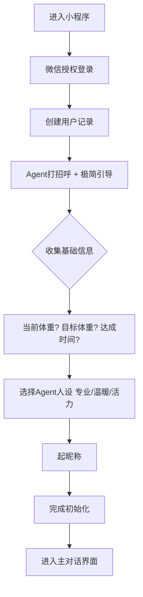
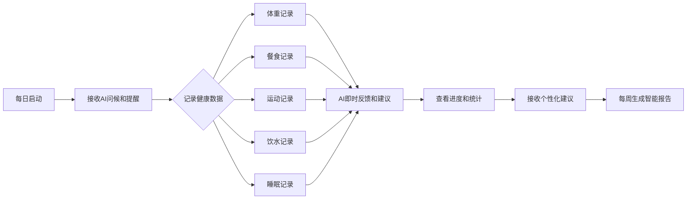

# 体重管理助手 - 产品需求文档（PRD）

**文档版本**: 1.2  
**创建日期**: 2026-02-14  
**状态**: 基于现有代码梳理的完整业务功能文档  
**功能状态**: ✅ 已实现 | 🔄 待完成/待完善

## 一、产品概述

### 1.1 产品定位
**AI驱动的个性化体重管理伙伴**，通过对话式交互帮助用户科学减重、养成健康习惯。

### 1.2 核心价值主张
1. **深度个性化** - 基于用户画像的1对1长期记忆，像老朋友一样懂你
2. **对话即操作** - 所有功能在对话框内完成，无需跳转页面
3. **智能洞察** - AI发现隐藏模式（睡眠-体重关联、情绪性进食等）
4. **长期陪伴** - 不是工具，是养成习惯的伙伴

### 1.3 竞品对比（薄荷健康）
| 功能维度 | 薄荷健康 | 本产品 |
|---------|---------|--------|
| 记录方式 | 手动输入为主 | AI对话识别 + 手动补充 |
| 个性化 | 通用建议模板 | 基于用户画像的动态个性化 |
| 交互体验 | 功能型App操作 | 陪伴型Agent对话 |
| 数据分析 | 基础统计图表 | AI模式洞察 + 智能建议 |
| 情感支持 | 有限的鼓励机制 | 情感化AI陪伴 + 心理支持 |

## 二、用户角色与画像

### 2.1 核心用户角色

#### 1. **普通用户**
- **特征**: 有减重/体重管理需求的个人用户
- **使用场景**: 
  - 日常体重记录和监控
  - 饮食、运动、饮水、睡眠数据记录
  - 与AI助手对话获取建议和鼓励
  - 查看周报和进度追踪

#### 2. **VIP用户**（商业化扩展）
- **特征**: 付费用户，享受增强功能
- **特权**:
  - 无限AI对话次数
  - 高级AI模式洞察
  - 个性化食谱生成
  - 营养师咨询服务

#### 3. **管理员**（运营后台）
- **特征**: 系统运营人员
- **职责**:
  - 用户管理和数据分析
  - 内容管理（食物库、提示词等）
  - 系统配置和监控
  - 咨询处理（营养师工作台）

#### 4. **营养师**（商业化扩展）
- **特征**: 专业健康顾问
- **功能**:
  - 回答用户专业咨询
  - 查看用户健康档案
  - 提供个性化建议

### 2.2 用户旅程地图

#### **首次使用旅程**


#### **日常使用旅程**


## 三、核心功能模块

### 3.1 用户管理系统

#### **3.1.1 用户注册与登录**
- 🔄 **微信授权登录**: 通过wx.login获取code，后端调用微信API获取openid（模拟实现，待集成）
- ✅ **用户档案创建**: 自动创建基础用户记录和默认Agent配置
- ✅ **Token管理**: JWT令牌认证，有效期管理

#### **3.1.2 用户档案管理**
- ✅ **基础信息**: 昵称、头像、联系方式
- ✅ **健康档案**: 年龄、性别、身高、基础代谢率（BMR）
- ✅ **偏好设置**: 饮食偏好、运动习惯、通知偏好（通过小调查收集）
- ✅ **用户画像**: 动力类型（数据驱动/情感支持/目标导向）、生活习惯、饮食习惯、运动偏好（通过每日小调查系统收集）

#### **3.1.3 Agent个性化配置**
- ✅ **助手命名**: 自定义AI助手名称
- ✅ **性格选择**: 专业型、温暖型、活力型三种风格
- ✅ **提示词管理**: 系统级提示词+个性化提示词融合

### 3.2 健康数据记录系统

#### **3.2.1 体重记录**
- ✅ **手动记录**: 输入体重、体脂率、记录时间、备注
- ✅ **智能识别**: 自然语言输入（如"今天早上68.5kg"）
- ✅ **趋势分析**: 7天/30天趋势图，变化统计
- ✅ **数据验证**: 合理范围检查（20-300kg）

#### **3.2.2 饮食记录**
- **多模式记录**:
  - ✅ **文字描述**: "中午吃了米饭、青菜、鸡胸肉"
  - ✅ **图片识别**: 上传餐食照片，AI识别食物和热量
  - ✅ **快速选择**: 常用食物库快捷选择（2026-02-14已完成）
    - 系统食物库（15+种常见中餐）
    - 最近食用记录（自动提取历史）
    - 收藏食物功能（自定义收藏）
- ✅ **热量计算**: 基于食物数据库自动计算总热量
- ✅ **餐食分类**: 早餐、午餐、晚餐、加餐
- ✅ **确认机制**: AI识别结果用户确认/修正（2026-02-14已完成）
  - 确认卡片展示AI识别结果
  - 0.5x-1.5x滑动条调整分量
  - 重新描述功能，AI重新解析
  - 确认后保存到数据库

#### **3.2.3 运动记录**
- ✅ **运动类型**: 跑步、快走、游泳、健身等预设类型
- ✅ **强度分级**: 低、中、高三级强度
- ✅ **热量计算**: 基于运动类型、时长、强度计算消耗
- ✅ **打卡功能**: 快速运动打卡记录

#### **3.2.4 饮水记录**
- ✅ **水量记录**: 记录每次饮水量（ml）
- ✅ **目标追踪**: 每日饮水目标（默认2000ml）及进度计算（暂不支持用户自定义目标）
- ✅ **间隔提醒**: 可配置的饮水提醒间隔

#### **3.2.5 睡眠记录**
- ✅ **时间记录**: 入睡时间、起床时间
- ✅ **质量评估**: 1-5星睡眠质量评分
- ✅ **时长计算**: 自动计算睡眠总时长
- ✅ **模式分析**: 睡眠规律性分析（2026-02-14已完成）
  - 入睡/起床时间规律性评分（基于CV变异系数）
  - 睡眠时长规律性分析
  - 睡眠质量趋势图表
  - 睡眠-体重变化关联性分析

### 3.3 AI对话与智能建议系统

#### **3.3.1 核心对话引擎**
- **多版本Agent**:
  - ✅ **Simple版**: 基于LangGraph create_react_agent的简化实现
  - ✅ **New版**: 完整LangChain实现，支持工具调用和记忆管理
- ✅ **工具调用**: 集成体重记录、饮食记录、数据查询等工具
- ✅ **流式响应**: 支持OpenAI流式输出，逐字显示

#### **3.3.2 智能建议生成**
- ✅ **每日建议**: 基于当天数据生成的个性化建议
- ✅ **场景化建议**:
  - 体重未记录 → "记录体重"建议
  - 早餐未记录 → "记录早餐"建议  
  - 饮水不足 → "多喝水"建议
- ✅ **建议风格**: 轻松科普、温暖鼓励、生活技巧、冷知识、今日小事、趣味问答六种风格随机切换

#### **3.3.3 记忆管理系统**
- ✅ **短期记忆**: 最近对话上下文（窗口大小可配置）
- ✅ **长期记忆**: 用户画像持久化存储
- ✅ **向量记忆**: ChromaDB向量存储，支持语义检索
- ✅ **记忆摘要**: 定期生成对话摘要，提炼关键信息（2026-02-14已完成）

#### **3.3.4 富媒体消息**
- **消息类型**:
  - ✅ 文本消息（基础）
  - ✅ 卡片消息（数据展示）（2026-02-14已完成渲染器和CSS）
  - ✅ 图片消息（食谱示例）（框架支持）
  - ✅ 表单消息（数据收集）（2026-02-14已完成渲染器和CSS）
  - ✅ 快捷操作（按钮交互）（2026-02-14已完成渲染器和CSS）
- ✅ **结构化响应**: JSON格式定义，前端动态渲染

### 3.4 提醒与通知系统

#### **3.4.1 智能提醒调度**
- ✅ **提醒类型**: 体重、三餐、运动、饮水、睡眠、周报
- ✅ **时间配置**: 精确到分钟的提醒时间设置
- 🔄 **条件触发**: 基于用户习惯和数据的智能触发（目前主要为时间触发，无数据条件触发）
- ✅ **免打扰**: 可配置的免打扰时间段

#### **3.4.2 通知渠道**
- ✅ **聊天通知**: 通过对话界面推送
- 🔄 **企业微信**: 集成企业微信机器人（待集成）
- 🔄 **邮件通知**: 重要报告和摘要邮件（待实现）
- ✅ **推送队列**: 异步通知队列，支持重试机制

#### **3.4.3 智能决策引擎**
- 🔄 **决策模式**:（框架已搭建，包含3种模式逻辑，但未集成到通知调度系统）
  - 保守模式（80%规则 + 20%AI）- 新手用户
  - 平衡模式（50%规则 + 50%AI）- 默认
  - 智能模式（20%规则 + 80%AI）- 高级用户
- 🔄 **事件检测**: 商务应酬、身体不适、旅行出差等特殊场景识别（部分实现）
- 🔄 **个性化调整**: 基于用户画像的提醒策略优化（待完善）

### 3.5 报告与数据分析系统

#### **3.5.1 每周智能报告**
- ✅ **数据聚合**: 一周体重、饮食、运动、睡眠数据汇总
- ✅ **趋势分析**: 体重变化趋势，热量平衡分析
- ✅ **亮点识别**: 本周进步和成就识别
- ✅ **改进建议**: 基于数据的个性化改进建议
- 🔄 **AI洞察**: 隐藏模式发现（如压力与饮食关联）（待完善）

#### **3.5.2 进度追踪**
- ✅ **目标进度**: 目标体重达成进度可视化
- ✅ **习惯养成**: 连续打卡天数统计（2026-02-14已完成）
  - 多维度打卡统计（体重/餐食/运动/饮水/睡眠）
  - 30天习惯养成进度可视化
  - 年度打卡热力图（GitHub风格）
  - 综合习惯评分算法
- 🔄 **成就系统**: 解锁各类成就徽章（待实现）
- 🔄 **积分体系**: 记录行为奖励积分（待实现）

#### **3.5.3 数据导出**
- 🔄 **格式支持**: Excel、PDF格式导出（待实现）
- 🔄 **数据范围**: 可选择时间范围导出（待实现）
- 🔄 **内容包含**: 原始数据+分析报告（待实现）

### 3.6 后台管理系统

#### **3.6.1 用户管理**
- ✅ **用户列表**: 搜索、筛选、分页查看
- ✅ **用户详情**: 完整健康数据查看
- ✅ **对话监控**: 用户对话历史查看（客服支持）

#### **3.6.2 内容管理**
- ✅ **食物数据库**: 15种基础中餐食物热量数据管理（支持用户自定义扩展，架构支持3000+扩展）
- 🔄 **食谱库**: 健康食谱管理（待实现）
- ✅ **提示词管理**: 系统提示词版本管理（基础CRUD实现）
- 🔄 **成就系统**: 成就条件和奖励配置（待实现）

#### **3.6.3 运营分析**
- 🔄 **用户活跃度**: DAU/MAU统计，留存分析（待实现）
- 🔄 **功能使用**: 各功能模块使用频率统计（待实现）
- 🔄 **减重效果**: 用户减重成功率分析（待实现）
- 🔄 **AI性能**: 识别准确率、响应时间监控（待实现）

#### **3.6.4 系统配置**
- ✅ **提醒模板**: 各类提醒消息模板配置（基础配置管理）
- ✅ **AI参数**: 模型选择、温度参数调整
- 🔄 **会员配置**: 会员等级和权益配置（待实现）
- 🔄 **积分规则**: 积分获取和消耗规则（待实现）

### 3.7 首页仪表盘系统

#### **3.7.1 热量平衡展示**
- ✅ **实时热量平衡计算**: 摄入 vs 消耗的实时对比计算
- ✅ **天平对比可视化**: 左侧饮食摄入，右侧总消耗（基础代谢 + 运动消耗）的直观天平布局
- ✅ **热量缺口/盈余状态**: 根据净热量值显示"盈余"、"平衡"、"缺口"状态
- ✅ **剩余可摄入量**: 计算并显示今日还可摄入的热量值
- ✅ **减肥公式验证**: 实时验证"饮食摄入 < 基础代谢 + 运动消耗"的减肥公式
- ✅ **状态指示器**: 根据热量平衡情况提供个性化状态提示和建议

#### **3.7.2 每日AI建议**
- ✅ **个性化建议生成**: AI基于用户画像和当前数据生成个性化健康建议
- ✅ **6种建议风格**: 轻松科普、温暖鼓励、生活技巧、冷知识、今日小事、趣味问答随机切换
- ✅ **关联操作按钮**: 建议内容关联快捷操作按钮（如"记录体重"、"记录饮水"等）
- ✅ **手动刷新**: 支持用户手动刷新获取新建议
- ✅ **默认建议库**: 内置15+条健康知识、鼓励话语作为备选建议

#### **3.7.3 用户画像小调查**
- ✅ **主动推送机制**: 模拟企业微信主动触达，根据画像完整度推送问题
- ✅ **丰富问题库**: 5大类20+个问题（基础信息、饮食偏好、运动习惯、睡眠休息、心理动机）
- ✅ **智能推送策略**: 优先推送关键基础信息问题，随后随机推送其他类别问题
- ✅ **进度追踪**: 显示"了解你 X%"进度条，激励用户完成画像收集
- ✅ **多题型支持**: 支持单选选择题和表单输入题两种题型
- ✅ **数据自动集成**: 回答数据自动更新用户画像并用于个性化服务

## 四、详细业务流程图

### 4.1 餐食记录完整流程
```
用户触发（提醒/主动）
    ↓
Agent推送提醒消息
    ↓
用户响应（照片/文字/快捷按钮）
    ↓
[如果是照片]
    ↓
后端接收 → AI视觉分析
    ├─ 识别食物种类
    ├─ 估算分量
    └─ 查询食物数据库计算热量
    ↓
Agent回复识别结果卡片
    ┌─────────────────────┐
    │ 📸 [餐食照片]        │
    │                     │
    │ 识别结果: 番茄鸡蛋面  │
    │ 估算热量: 450千卡    │
    │ 今日午餐建议: 500千卡│
    │                     │
    │ [确认] [调整] [不对] │
    └─────────────────────┘
    ↓
用户操作选择
    ├─ [确认] → 记录完成 → 展示今日热量进度
    ├─ [调整] → 滑动条调整 → 重新计算 → 确认
    └─ [不对] → 文字重新描述 → AI重新解析 → 确认
    ↓
[后台] 更新用户画像和缓存
```

### 4.2 AI对话处理流程
```
用户发送消息
    ↓
API路由接收 → 参数验证
    ↓
保存用户消息到数据库
    ↓
调用LangChain Agent
    ├─ 加载用户画像和记忆
    ├─ 意图识别和工具选择
    ├─ 执行工具调用（如记录数据）
    └─ 生成结构化回复
    ↓
保存Agent回复到数据库
    ↓
返回结构化响应
    ↓
前端根据消息类型渲染
    ├─ 文本消息 → 普通气泡
    ├─ 卡片消息 → 数据卡片
    ├─ 快捷操作 → 按钮组
    └─ 图片消息 → 图片展示
```

### 4.3 智能提醒决策流程
```
定时任务触发（每5分钟）
    ↓
遍历所有活跃用户
    ↓
检查用户当前状态
    ├─ 免打扰时段？ → 跳过
    ├─ 今日已提醒次数？ → 限制检查
    └─ 用户画像分析 → 个性化策略
    ↓
智能决策引擎
    ├─ 规则引擎匹配（时间/条件）
    ├─ AI引擎建议（个性化场景）
    ├─ 加权决策（基于用户类型）
    └─ 生成提醒内容和时机
    ↓
添加到通知队列
    ↓
异步发送通知
    ├─ 成功 → 更新发送状态
    ├─ 失败 → 重试机制
    └─ 多次失败 → 降级处理
```

### 4.4 用户画像收集流程
```
用户进入首页
    ↓
检查用户画像完整度
    ├─ 基础信息缺失 → 推送表单问题（性别/年龄/身高/体重）
    ├─ 偏好信息不足 → 推送选择题（饮食/运动/睡眠习惯）
    └─ 画像完整 → 显示热量平衡和每日建议
    ↓
小调查卡片展示（插入到聊天区域顶部）
    ├─ 用户回答 → 更新画像 + 显示进度 + 刷新热量计算
    ├─ 用户跳过 → 下次再问（记录跳过次数）
    └─ 用户关闭 → 暂时隐藏（下次访问可能再次推送）
    ↓
画像数据用于个性化AI建议和热量计算
    ├─ 更新用户画像缓存
    ├─ 刷新热量平衡卡片数据
    └─ 生成更精准的每日建议
```

## 五、数据模型与业务实体

### 5.1 核心实体关系
```
User (用户)
├── UserProfile (用户画像) - 1:1（包含小调查回答数据）
├── AgentConfig (Agent配置) - 1:1
├── WeightRecord (体重记录) - 1:N
├── MealRecord (饮食记录) - 1:N
├── ExerciseRecord (运动记录) - 1:N
├── WaterRecord (饮水记录) - 1:N
├── SleepRecord (睡眠记录) - 1:N
├── Goal (目标) - 1:N
├── ChatHistory (对话历史) - 1:N
└── UserProfileCache (画像缓存) - 1:1（用于首页热量计算缓存）
```

### 5.2 关键业务枚举

#### **Agent性格类型**
- `PROFESSIONAL` - 专业型：数据驱动，科学严谨
- `WARM` - 温暖型：情感支持，朋友陪伴  
- `ENERGETIC` - 活力型：积极鼓励，充满动力

#### **用户动力类型**
- `DATA_DRIVEN` - 数据驱动：关注数字和进度
- `EMOTIONAL_SUPPORT` - 情感支持：需要鼓励和陪伴
- `GOAL_ORIENTED` - 目标导向：关注目标和成就

#### **提醒类型**
- `WEIGHT` - 体重提醒
- `BREAKFAST/LUNCH/DINNER/SNACK` - 餐食提醒
- `EXERCISE` - 运动提醒
- `WATER` - 饮水提醒
- `SLEEP` - 睡眠提醒
- `WEEKLY` - 周报提醒

#### **用户画像问题类别**
- `BASIC` - 基础信息类：性别、年龄、身高、体重等关键数据
- `DIET` - 饮食偏好类：主食偏好、饮食方式、甜食态度、蛋白质来源、饮品习惯
- `EXERCISE` - 运动习惯类：运动频率、运动时间、运动类型偏好
- `SLEEP` - 睡眠休息类：睡眠质量、睡眠时长、睡前习惯
- `MOTIVATION` - 心理动机类：减重目标、主要挑战、期望的助手风格
- `SCENARIO` - 趣味场景类：成功后的愿景、社交饮食应对策略

## 六、API接口概览

### 6.1 主要API模块
| 模块 | 基础路径 | 核心功能 | 文件位置 |
|------|---------|---------|----------|
| 用户管理 | `/api/user` | 登录、档案、偏好 | `api/routes/user.py` |
| 体重记录 | `/api/weight` | 记录、历史、趋势 | `api/routes/weight.py` |
| 运动记录 | `/api/exercise` | 打卡、消耗、统计 | `api/routes/exercise.py` |
| 饮食记录 | `/api/meal` | 记录、AI识别、营养 | `api/routes/meal.py` |
| 饮水记录 | `/api/water` | 记录、目标、提醒 | `api/routes/water.py` |
| 睡眠记录 | `/api/sleep` | 记录、质量分析 | `api/routes/sleep.py` |
| AI对话 | `/api/chat` | 聊天、历史、记忆 | `api/routes/chat.py` |
| 报告生成 | `/api/report` | 周报、导出 | `api/routes/report.py` |
| 提醒设置 | `/api/reminder` | 设置、通知 | `api/routes/reminder.py` |
| 用户画像 | `/api/profiling` | 分析、偏好 | `api/routes/profiling.py` |
| 目标管理 | `/api/goals` | 设置、进度 | `api/routes/goals.py` |
| 热量计算 | `/api/calories` | 计算、消耗 | `api/routes/calories.py` |
| 管理后台 | `/admin/*` | 后台管理 | `api/routes/admin/*.py` |

### 6.2 关键API端点

#### **AI对话端点**
- `POST /api/chat/send` - 发送消息（支持流式响应）
- `POST /api/chat/upload-image` - 上传图片用于食物识别
- `GET /api/chat/history` - 获取对话历史
- `GET /api/chat/daily-suggestion` - 获取每日AI建议
- `POST /api/chat/memory/search` - 搜索用户长期记忆

#### **数据记录端点**
- `POST /api/weight/record` - 记录体重数据
- `POST /api/meal/record` - 记录餐食（支持图片上传）
- `POST /api/meal/analyze-with-confirm` - AI分析餐食照片（带确认流程）
- `POST /api/meal/confirm` - 确认AI识别结果并保存
- `POST /api/meal/reanalyze` - 根据重新描述分析餐食
- `POST /api/meal/cancel` - 取消餐食确认
- `POST /api/exercise/record` - 记录运动打卡
- `POST /api/water/record` - 记录饮水量
- `POST /api/sleep/record` - 记录睡眠数据

#### **睡眠分析端点**
- `GET /api/sleep/analysis/pattern` - 睡眠规律性分析
- `GET /api/sleep/analysis/quality-trend` - 睡眠质量趋势
- `GET /api/sleep/analysis/weight-correlation` - 睡眠-体重关联分析
- `GET /api/sleep/analysis/dashboard` - 睡眠分析仪表盘（综合）

#### **首页功能端点**
- `GET /api/calories/balance/daily` - 获取每日热量平衡数据（包含摄入、消耗、缺口等）
- `GET /api/calories/balance/distribution` - 获取热量分布数据（三餐热量占比）
- `GET /api/chat/daily-suggestion` - 获取每日AI建议（支持refresh参数刷新）
- `GET /api/profiling/next-question` - 获取下一个未回答的用户画像问题
- `POST /api/profiling/submit-answer` - 提交用户画像问题回答
- `GET /api/profiling/progress` - 获取用户画像收集进度
- `POST /api/profiling/submit-form` - 简化的表单提交API（用于基础信息收集）

#### **习惯打卡端点**
- `GET /api/habit/streaks` - 连续打卡统计
- `GET /api/habit/heatmap` - 打卡热力图
- `GET /api/habit/progress` - 习惯养成进度
- `GET /api/habit/recent` - 最近打卡记录
- `GET /api/habit/dashboard` - 习惯打卡仪表盘

#### **快速食物端点**
- `GET /api/meal/foods/quick` - 快速选择食物列表（系统+最近+收藏）
- `GET /api/meal/foods/recent` - 最近食用食物
- `GET /api/meal/foods/favorites` - 收藏食物列表
- `POST /api/meal/foods/favorites` - 添加收藏
- `DELETE /api/meal/foods/favorites` - 取消收藏

## 七、非功能性需求

### 7.1 性能要求
- **响应时间**: API平均响应时间 < 2秒
- **AI对话**: 流式响应首字时间 < 1秒
- **并发支持**: 支持100+用户同时在线
- **数据处理**: 大数据量查询优化，使用索引和缓存

### 7.2 可用性要求
- **系统可用性**: 99.5% 正常运行时间
- **错误率**: 用户可见错误率 < 1%
- **兼容性**: 支持主流浏览器和微信小程序
- **可访问性**: 界面符合无障碍设计基础要求

### 7.3 安全性要求
- **数据加密**: 敏感数据传输加密（HTTPS）
- **认证授权**: JWT令牌认证，权限验证
- **输入验证**: 所有用户输入验证和过滤
- **文件上传**: 文件类型、大小、路径安全验证
- **数据隔离**: 用户数据严格隔离，防止越权访问

### 7.4 可维护性要求
- **代码质量**: 符合PEP8规范，类型提示覆盖 > 90%
- **文档完整性**: API文档、架构文档、部署文档齐全
- **监控告警**: 关键指标监控和异常告警
- **日志系统**: 统一结构化日志，支持问题排查

### 7.5 扩展性要求
- **模块化设计**: 功能模块低耦合，便于独立扩展
- **配置驱动**: 系统行为可通过配置调整
- **插件架构**: 支持新功能插件式集成
- **多租户支持**: 架构设计支持未来多租户扩展

## 八、技术架构要点

### 8.1 核心技术栈
- **后端框架**: FastAPI (Python 3.9+)
- **数据库**: SQLite (开发) / PostgreSQL (生产)
- **ORM**: SQLAlchemy 2.0 (异步)
- **AI框架**: LangChain + LangGraph
- **向量存储**: ChromaDB (可选)
- **前端**: 原生HTML/CSS/JS + 微信小程序

### 8.2 架构特点
1. **异步优先**: 全面使用async/await，提高并发性能
2. **分层清晰**: API层 → 服务层 → 数据层，职责分离
3. **配置中心化**: 所有配置集中在config目录，支持环境变量
4. **多版本Agent**: 渐进式演进，支持版本平滑切换
5. **缓存优化**: 数据库级用户画像缓存，重启不丢失

### 8.3 部署架构
```
开发环境: Python直接运行 + SQLite本地文件
生产环境: 云服务器 + PostgreSQL + Redis + OSS存储
容器化: Docker + docker-compose (规划中)
CI/CD: GitHub Actions + 自动化测试 (规划中)
```

## 九、商业化规划（扩展功能）
**状态**: 🔄 规划中（待实现）

### 9.1 会员体系设计
| 功能 | 免费版 | 基础会员(¥19/月) | 高级会员(¥49/月) |
|------|--------|------------------|------------------|
| 体重记录 | ✓ | ✓ | ✓ |
| 基础对话 | 50条/月 | 无限 | 无限 |
| 餐食AI识别 | 3次/日 | 10次/日 | 无限 |
| 智能分析 | 基础周报 | 周报+月报 | 周报+月报+AI洞察 |
| 食谱推荐 | 基础推荐 | 个性化推荐 | 定制化食谱 |
| 营养师咨询 | - | 1次/月 | 无限 |
| 数据导出 | - | Excel格式 | Excel+PDF格式 |
| 广告展示 | 有 | 无 | 无 |

### 9.2 积分激励体系
**获取积分**:
- 每日打卡：+5分
- 连续7天记录：+20分
- 达成减重目标：+100分  
- 完成挑战任务：+30分
- 邀请好友注册：+50分

**消耗积分**:
- 解锁专属食谱：-50分
- 延长AI对话额度：-10分/次
- 兑换实物奖励：按商城定价

### 9.3 增值服务
1. **营养师一对一咨询**: 按次/包月收费
2. **企业健康管理**: B端服务，公司员工健康管理
3. **数据服务**: 匿名化健康数据分析（B端合作）
4. **硬件集成**: 体脂秤、运动手环数据同步

## 十、成功指标与监控

### 10.1 核心业务指标
- **用户活跃度**: DAU/MAU，7日留存率 > 40%
- **功能使用率**: 体重记录率 > 70%，对话活跃度 > 60%
- **减重效果**: 用户平均减重速度（kg/周）
- **用户满意度**: NPS > 30，评分 > 4.5/5

### 10.2 技术性能指标
- **API成功率**: > 99%
- **响应时间**: P95 < 3秒
- **AI识别准确率**: > 85%
- **系统错误率**: < 0.5%

### 10.3 监控体系
- **应用监控**: 健康检查、错误日志、性能指标
- **业务监控**: 用户行为漏斗、转化率、留存分析
- **AI监控**: 对话质量、工具调用成功率、响应时间
- **基础设施**: 服务器资源、数据库性能、网络状况

## 十一、附录

### 11.1 术语表
- **BMR**: 基础代谢率（Basal Metabolic Rate）
- **TDEE**: 每日总能量消耗（Total Daily Energy Expenditure）
- **Agent**: AI助手，用户的体重管理伙伴
- **用户画像**: 用户的长期记忆和个性化配置
- **结构化消息**: 包含类型、内容、操作的数据格式

### 11.2 相关文档链接
- [完整设计文档](plans/2025-02-07-weight-management-design.md)
- [AI对话系统设计](ai_chat_system_design.md)
- [智能通知决策系统](intelligent_notification_decision_system.md)
- [API接口参考手册](api_reference.md)
- [数据库设计文档](database_schema.md)

### 11.3 版本历史
| 版本 | 日期 | 变更说明 | 负责人 |
|------|------|---------|--------|
| 1.0 | 2026-02-14 | 基于现有代码梳理的完整PRD | opencode |
| 1.1 | 2026-02-14 | 添加功能状态标注（✅已实现/🔄待完成） | opencode |
| 1.2 | 2026-02-14 | 补充首页热量平衡展示、每日小调查系统功能描述 | opencode |

---
**文档说明**: 本PRD基于现有体重管理助手项目代码梳理而成，反映了当前系统的完整业务功能和技术实现。可作为产品规划、技术开发、运营推广的参考依据。