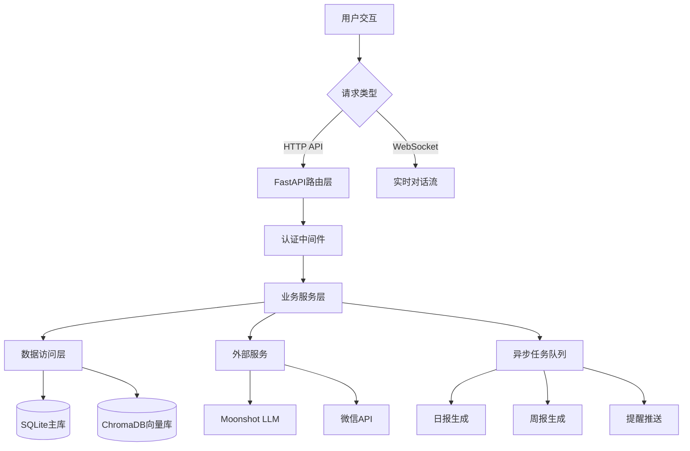
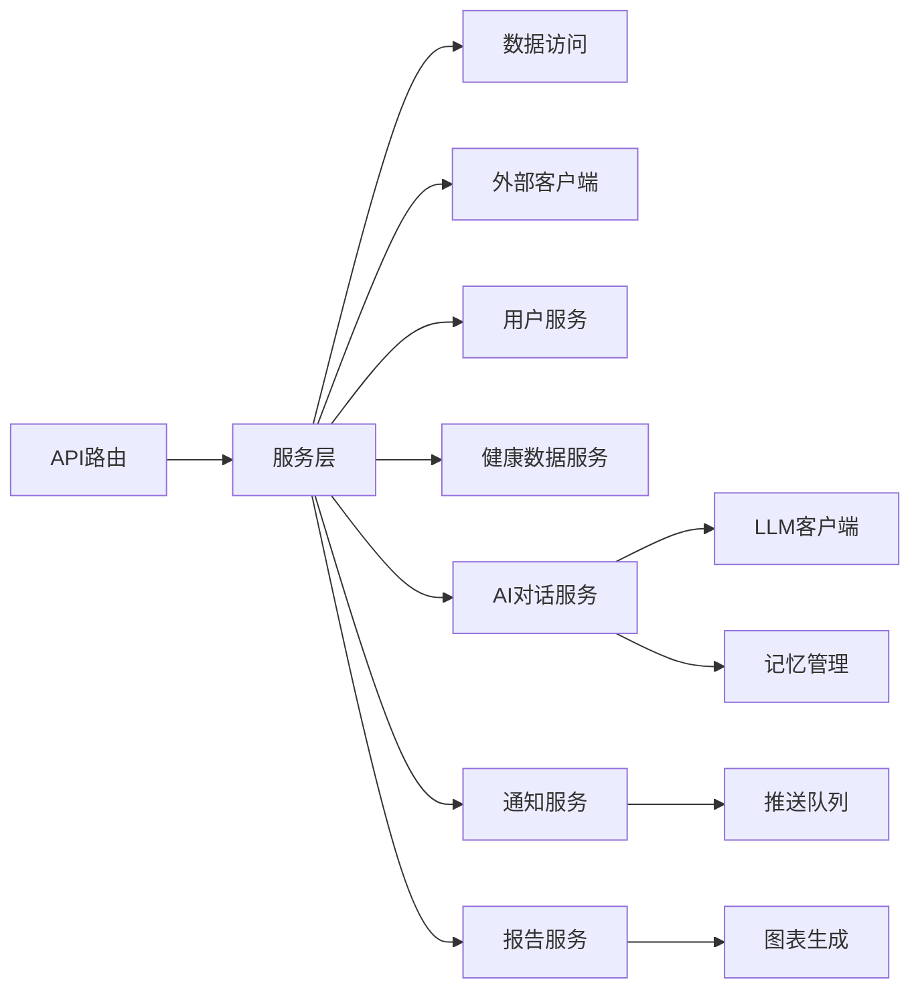
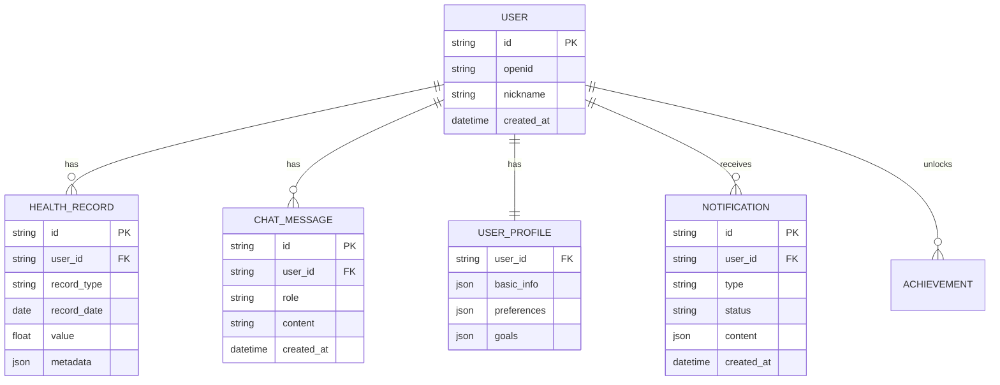
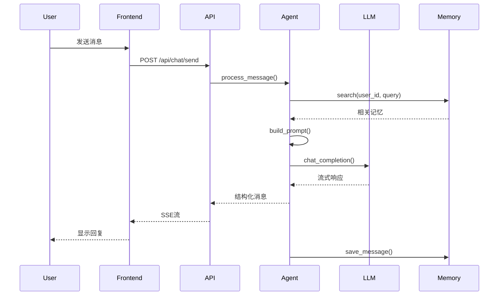

# 体重管理助手 - 技术架构文档

**文档版本**: 1.0  
**创建日期**: 2026-02-18  
**关联PRD**: [产品需求文档](./PRD.md)

---

## 目录

1. [整体技术架构](#一整体技术架构)
2. [系统架构图](#二系统架构图)
3. [技术栈选型](#三技术栈选型)
4. [核心模块技术实现](#四核心模块技术实现)
5. [API设计规范](#五api设计规范)
6. [数据库设计](#六数据库设计)
7. [前端架构](#七前端架构)
8. [AI集成方案](#八ai集成方案)
9. [部署架构](#九部署架构)
10. [附录：详细实现](#十附录详细实现)

---

## 一、整体技术架构

### 1.1 架构分层

```
┌─────────────────────────────────────────────────────────────┐
│                      前端展示层                              │
│  ┌──────────┐ ┌──────────┐ ┌──────────┐ ┌──────────┐       │
│  │ 首页     │ │ 对话页面 │ │ 打卡页面 │ │ 报告页面 │       │
│  │ (Vue.js) │ │ (原生JS) │ │ (Vue.js) │ │ (Chart.js)│      │
│  └──────────┘ └──────────┘ └──────────┘ └──────────┘       │
└─────────────────────────────────────────────────────────────┘
                              │
                              ▼
┌─────────────────────────────────────────────────────────────┐
│                      API网关层                               │
│              FastAPI + JWT认证 + 请求限流                     │
└─────────────────────────────────────────────────────────────┘
                              │
                              ▼
┌─────────────────────────────────────────────────────────────┐
│                      业务服务层                              │
│  ┌──────────┐ ┌──────────┐ ┌──────────┐ ┌──────────┐       │
│  │ 用户服务 │ │ 健康数据 │ │ AI对话   │ │ 通知服务 │       │
│  │ User     │ │ Health   │ │ Chat     │ │ Notify   │       │
│  └──────────┘ └──────────┘ └──────────┘ └──────────┘       │
│  ┌──────────┐ ┌──────────┐ ┌──────────┐ ┌──────────┐       │
│  │ 报告服务 │ │ 任务调度 │ │ 画像服务 │ │ 成就系统 │       │
│  │ Report   │ │ Scheduler│ │ Profile  │ │ Achievement│     │
│  └──────────┘ └──────────┘ └──────────┘ └──────────┘       │
└─────────────────────────────────────────────────────────────┘
                              │
                              ▼
┌─────────────────────────────────────────────────────────────┐
│                      数据访问层                              │
│  ┌──────────┐ ┌──────────┐ ┌──────────┐ ┌──────────┐       │
│  │ SQLAlchemy│ │ ChromaDB │ │ Redis   │ │ 文件存储 │       │
│  │ (SQLite) │ │ (向量)   │ │ (缓存)  │ │ (上传)  │       │
│  └──────────┘ └──────────┘ └──────────┘ └──────────┘       │
└─────────────────────────────────────────────────────────────┘
                              │
                              ▼
┌─────────────────────────────────────────────────────────────┐
│                      外部服务层                              │
│  ┌──────────┐ ┌──────────┐ ┌──────────┐ ┌──────────┐       │
│  │ Moonshot │ │ 微信API  │ │ 邮件服务 │ │ 企业微信 │       │
│  │ (LLM)    │ │ (登录)   │ │ (SMTP)  │ │ (推送)  │       │
│  └──────────┘ └──────────┘ └──────────┘ └──────────┘       │
└─────────────────────────────────────────────────────────────┘
```

### 1.2 核心组件说明

| 组件 | 技术选型 | 职责 |
|------|---------|------|
| Web框架 | FastAPI | RESTful API、自动文档、异步支持 |
| ORM | SQLAlchemy | 数据库模型、关系映射、迁移管理 |
| 向量数据库 | ChromaDB | 长期记忆存储、语义检索 |
| 缓存 | Redis (可选) | 会话缓存、热点数据 |
| 任务调度 | APScheduler | 定时任务（日报、周报、提醒） |
| LLM客户端 | 自定义封装 | Moonshot API调用、流式响应 |
| 前端框架 | Vue.js + 原生JS | 单页应用、组件化开发 |
| 图表库 | Chart.js | 数据可视化、报告图表 |

---

## 二、系统架构图

### 2.1 数据流架构



### 2.2 模块依赖关系



---

## 三、技术栈选型

### 3.1 后端技术栈

| 类别 | 技术 | 版本 | 选型理由 |
|------|------|------|---------|
| 语言 | Python | 3.8+ | 丰富的AI生态、开发效率高 |
| Web框架 | FastAPI | 0.100+ | 高性能、自动文档、类型提示 |
| ORM | SQLAlchemy | 2.0+ | 成熟稳定、支持异步 |
| 数据库 | SQLite | 3.35+ | 轻量级、无需额外服务 |
| 向量库 | ChromaDB | 0.4+ | 本地存储、轻量级 |
| 认证 | JWT | PyJWT 2.0+ | 无状态、易于扩展 |
| 任务调度 | APScheduler | 3.10+ | 灵活、支持多种触发器 |
| HTTP客户端 | httpx | 0.24+ | 异步支持、类型友好 |
| 数据验证 | Pydantic | 2.0+ | 与FastAPI深度集成 |

### 3.2 前端技术栈

| 类别 | 技术 | 版本 | 选型理由 |
|------|------|------|---------|
| 基础 | HTML5 + CSS3 + ES6+ | - | 标准技术、兼容性好 |
| 组件框架 | Vue.js 3 | 3.3+ | 响应式、组件化 |
| 样式 | 自定义CSS | - | 轻量级、可控性强 |
| 图表 | Chart.js | 4.0+ | 轻量、易用、响应式 |
| 网络请求 | Fetch API | - | 原生支持、Promise |
| 存储 | LocalStorage | - | 简单状态持久化 |

### 3.3 AI与外部服务

| 服务 | 用途 | 接入方式 |
|------|------|---------|
| Moonshot (Kimi) | 核心对话AI | HTTP API + SSE流式 |
| 微信OAuth | 用户登录 | OAuth2.0 |
| 微信小程序 | 移动端入口 | WXML/WXSS/JS |
| 企业微信 | 通知推送 | Webhook API |
| SMTP | 邮件通知 | 标准SMTP协议 |

---

## 四、核心模块技术实现

### 4.1 用户管理模块

#### 数据模型

```python
# models/user.py
class User(Base):
    __tablename__ = "users"
    
    id = Column(String, primary_key=True)
    openid = Column(String, unique=True, index=True)
    nickname = Column(String)
    avatar_url = Column(String)
    created_at = Column(DateTime, default=datetime.utcnow)
    last_login = Column(DateTime)
    
    # 关联
    profile = relationship("UserProfile", back_populates="user", uselist=False)
    records = relationship("HealthRecord", back_populates="user")
```

#### 服务接口

```python
# services/user_service.py
class UserService:
    def __init__(self, db: Session):
        self.db = db
    
    async def get_or_create_by_openid(self, openid: str) -> User:
        """微信登录获取或创建用户"""
        ...
    
    async def update_profile(self, user_id: str, profile_data: dict) -> User:
        """更新用户画像"""
        ...
```

---

### 4.2 健康数据模块

#### 数据模型（统一记录表）

```python
# models/health_record.py
class HealthRecord(Base):
    __tablename__ = "health_records"
    
    id = Column(String, primary_key=True)
    user_id = Column(String, ForeignKey("users.id"))
    record_type = Column(String)  # weight, meal, exercise, water, sleep
    record_date = Column(Date)
    record_time = Column(Time)
    
    # 通用值字段（JSON存储差异字段）
    value = Column(Float)  # 体重、饮水量等
    value_text = Column(String)  # 文本描述
    metadata = Column(JSON)  # 扩展字段
    
    created_at = Column(DateTime, default=datetime.utcnow)
```

#### 服务接口

```python
# services/health_service.py
class HealthService:
    async def record_weight(self, user_id: str, weight: float, **kwargs):
        """记录体重"""
        ...
    
    async def record_meal(self, user_id: str, meal_type: str, foods: list, **kwargs):
        """记录餐食"""
        ...
    
    async def get_daily_summary(self, user_id: str, date: date) -> dict:
        """获取当日数据汇总"""
        ...
```

---

### 4.3 AI对话模块

#### 架构设计

```
┌─────────────────────────────────────────┐
│           AI对话服务层                   │
├─────────────────────────────────────────┤
│  ┌─────────┐ ┌─────────┐ ┌─────────┐   │
│  │ 对话管理 │ │ 工具调用 │ │ 记忆检索 │   │
│  └─────────┘ └─────────┘ └─────────┘   │
├─────────────────────────────────────────┤
│           LangChain Agent               │
├─────────────────────────────────────────┤
│  ┌─────────┐ ┌─────────┐ ┌─────────┐   │
│  │ LLM客户端│ │ 提示词  │ │ 输出解析 │   │
│  │Moonshot │ │ 管理   │ │ 器     │   │
│  └─────────┘ └─────────┘ └─────────┘   │
└─────────────────────────────────────────┘
```

#### LLM客户端封装

```python
# ai_clients/kimi_client.py
class KimiClient:
    def __init__(self, api_key: str):
        self.api_key = api_key
        self.base_url = "https://api.moonshot.cn/v1"
    
    async def chat_completion(
        self, 
        messages: list, 
        tools: list = None,
        stream: bool = False
    ) -> AsyncGenerator[str, None]:
        """流式对话完成"""
        ...
    
    async def generate_with_memory(
        self,
        user_id: str,
        query: str,
        context: dict
    ) -> str:
        """结合记忆生成回复"""
        # 1. 检索相关记忆
        memories = await self.memory_store.search(user_id, query)
        # 2. 组装提示词
        prompt = self.build_prompt(query, memories, context)
        # 3. 调用LLM
        return await self.chat_completion(prompt)
```

#### 记忆管理系统

```python
# services/memory_service.py
class MemoryService:
    def __init__(self, chroma_client):
        self.client = chroma_client
    
    async def add_memory(self, user_id: str, content: str, metadata: dict):
        """添加长期记忆"""
        collection = self.client.get_or_create_collection(f"user_{user_id}")
        collection.add(
            documents=[content],
            metadatas=[metadata],
            ids=[f"{user_id}_{datetime.now().timestamp()}"]
        )
    
    async def search_memories(self, user_id: str, query: str, top_k: int = 5) -> list:
        """语义检索记忆"""
        collection = self.client.get_collection(f"user_{user_id}")
        results = collection.query(query_texts=[query], n_results=top_k)
        return results
```

---

### 4.4 通知推送模块

#### 系统架构

```
┌─────────────────────────────────────────┐
│           通知调度器                     │
│     (APScheduler定时任务)               │
└─────────────────────────────────────────┘
                    │
                    ▼
┌─────────────────────────────────────────┐
│           通知生成器                     │
│  ┌─────────┐ ┌─────────┐ ┌─────────┐   │
│  │ 提醒通知 │ │ 日报   │ │ 周报   │   │
│  │ 生成器  │ │ 生成器 │ │ 生成器 │   │
│  └─────────┘ └─────────┘ └─────────┘   │
└─────────────────────────────────────────┘
                    │
                    ▼
┌─────────────────────────────────────────┐
│           推送渠道适配器                 │
│  ┌─────────┐ ┌─────────┐ ┌─────────┐   │
│  │ 对话推送 │ │ 微信   │ │ 邮件   │   │
│  └─────────┘ └─────────┘ └─────────┘   │
└─────────────────────────────────────────┘
```

#### 通知服务实现

```python
# services/notification_service.py
class NotificationService:
    def __init__(self, db: Session, push_client):
        self.db = db
        self.push_client = push_client
    
    async def create_notification(self, user_id: str, notification_type: str, content: dict):
        """创建通知记录"""
        notification = Notification(
            user_id=user_id,
            type=notification_type,
            content=content,
            status="pending",
            created_at=datetime.utcnow()
        )
        self.db.add(notification)
        self.db.commit()
        return notification
    
    async def push_to_chat(self, user_id: str, notification: Notification):
        """推送到对话界面"""
        message = self.format_notification_message(notification)
        await self.push_client.send_to_user(user_id, message)
        notification.status = "delivered"
        self.db.commit()
```

#### 前端轮询实现

```javascript
// static/js/notificationPoller.js
class NotificationPoller {
    constructor(options = {}) {
        this.interval = options.interval || 30000;
        this.lastCheckTime = null;
        this.isRunning = false;
    }
    
    start() {
        if (this.isRunning) return;
        this.isRunning = true;
        this.check();
        this.timer = setInterval(() => this.check(), this.interval);
    }
    
    async check() {
        try {
            const params = this.lastCheckTime 
                ? `?last_check_time=${encodeURIComponent(this.lastCheckTime)}` 
                : '';
            const response = await fetch(`/api/notifications/pending${params}`);
            const data = await response.json();
            
            if (data.notifications?.length > 0) {
                this.renderNotifications(data.notifications);
            }
            this.lastCheckTime = data.server_time;
        } catch (error) {
            console.error('通知轮询失败:', error);
        }
    }
}
```

---

### 4.5 报告生成模块

#### 日报生成服务

```python
# services/daily_report_service.py
class DailyReportService:
    def __init__(self, db: Session, llm_client: KimiClient):
        self.db = db
        self.llm = llm_client
    
    async def generate_daily_report(self, user_id: str, report_date: date) -> DailyReport:
        """生成日报"""
        # 1. 收集数据
        data = await self.collect_daily_data(user_id, report_date)
        
        # 2. 检查活跃度
        if not self.has_activity(data):
            return None
        
        # 3. 构建Prompt
        prompt = self.build_prompt(user_id, data)
        
        # 4. LLM生成
        content = await self.llm.chat_completion(prompt)
        
        # 5. 解析结构化数据
        return self.parse_report(content, data)
    
    def build_prompt(self, user_id: str, data: dict) -> str:
        """构建日报生成Prompt"""
        return f"""
你是一位温暖的体重管理教练，请为用户生成今日健康日报。

【用户基础信息】
- 昵称: {data['nickname']}
- 目标: {data['goal']}
- 动力类型: {data['motivation_type']}

【今日数据摘要】
{json.dumps(data['summary'], ensure_ascii=False)}

【今日互动记录】
{data['chat_history']}

【生成要求】
1. 语气根据动力类型调整
2. 内容结构：🌟今日亮点、⚠️温馨提示、💡明日建议
3. 总字数200-300字
4. 输出格式：Markdown
"""
```

#### 周报图表生成

```javascript
// static/js/charts/weeklyCharts.js
class WeeklyReportCharts {
    constructor(containerId) {
        this.container = document.getElementById(containerId);
    }
    
    renderWeightTrend(data) {
        const ctx = this.container.querySelector('#weightChart').getContext('2d');
        new Chart(ctx, {
            type: 'line',
            data: {
                labels: data.map(d => d.date),
                datasets: [{
                    label: '体重(kg)',
                    data: data.map(d => d.weight),
                    borderColor: '#34c759',
                    backgroundColor: 'rgba(52, 199, 89, 0.1)',
                    tension: 0.4,
                    fill: true
                }]
            },
            options: {
                responsive: true,
                plugins: { legend: { display: false } },
                scales: {
                    y: {
                        beginAtZero: false,
                        ticks: { callback: v => v + 'kg' }
                    }
                }
            }
        });
    }
}
```

---

## 五、API设计规范

### 5.1 RESTful API规范

#### URL设计

```
/api/v1/{资源}/{操作}

示例：
GET    /api/v1/users/me              # 获取当前用户
POST   /api/v1/health/weight         # 记录体重
GET    /api/v1/chat/history          # 获取对话历史
POST   /api/v1/chat/send             # 发送消息
GET    /api/v1/reports/daily         # 获取日报
GET    /api/v1/reports/weekly        # 获取周报
```

#### 响应格式

```json
{
  "success": true,
  "code": 200,
  "message": "操作成功",
  "data": { ... },
  "meta": {
    "timestamp": "2026-02-18T10:00:00Z",
    "request_id": "req_xxx"
  }
}
```

#### 错误格式

```json
{
  "success": false,
  "code": 400,
  "message": "请求参数错误",
  "errors": [
    {"field": "weight", "message": "体重必须在30-300kg之间"}
  ],
  "meta": { ... }
}
```

### 5.2 核心API列表

| 端点 | 方法 | 描述 | 认证 |
|------|------|------|------|
| `/api/v1/auth/wechat` | POST | 微信登录 | 否 |
| `/api/v1/users/me` | GET | 获取当前用户 | 是 |
| `/api/v1/users/profile` | PUT | 更新用户画像 | 是 |
| `/api/v1/health/weight` | POST | 记录体重 | 是 |
| `/api/v1/health/meal` | POST | 记录餐食 | 是 |
| `/api/v1/health/daily` | GET | 获取当日汇总 | 是 |
| `/api/v1/chat/send` | POST | 发送对话消息 | 是 |
| `/api/v1/chat/history` | GET | 获取对话历史 | 是 |
| `/api/v1/notifications/pending` | GET | 获取待处理通知 | 是 |
| `/api/v1/reports/daily` | GET | 获取日报 | 是 |
| `/api/v1/reports/weekly` | GET | 获取周报 | 是 |

---

## 六、数据库设计

### 6.1 实体关系图



### 6.2 核心表结构

#### 用户表 (users)

| 字段 | 类型 | 说明 |
|------|------|------|
| id | VARCHAR(32) PK | 用户唯一ID |
| openid | VARCHAR(64) | 微信openid |
| nickname | VARCHAR(64) | 昵称 |
| avatar_url | VARCHAR(256) | 头像URL |
| created_at | DATETIME | 创建时间 |
| last_login | DATETIME | 最后登录 |

#### 健康记录表 (health_records)

| 字段 | 类型 | 说明 |
|------|------|------|
| id | VARCHAR(32) PK | 记录ID |
| user_id | VARCHAR(32) FK | 用户ID |
| record_type | VARCHAR(32) | 记录类型 |
| record_date | DATE | 记录日期 |
| value | FLOAT | 数值 |
| value_text | VARCHAR(256) | 文本值 |
| metadata | JSON | 扩展数据 |
| created_at | DATETIME | 创建时间 |

#### 对话消息表 (chat_messages)

| 字段 | 类型 | 说明 |
|------|------|------|
| id | VARCHAR(32) PK | 消息ID |
| user_id | VARCHAR(32) FK | 用户ID |
| role | VARCHAR(16) | user/assistant |
| content | TEXT | 消息内容 |
| message_type | VARCHAR(32) | 消息类型 |
| created_at | DATETIME | 创建时间 |

---

## 七、前端架构

### 7.1 目录结构

```
static/
├── index.html              # 主页面（对话+首页）
├── weekly-report.html      # 周报页面
├── daily-report.html       # 日报页面
├── css/
│   ├── main.css           # 主样式
│   ├── components.css     # 组件样式
│   └── charts.css         # 图表样式
├── js/
│   ├── app.js             # 应用入口
│   ├── api.js             # API封装
│   ├── chat.js            # 对话逻辑
│   ├── components/        # 组件
│   │   ├── ChatRenderer.js
│   │   ├── NotificationCard.js
│   │   ├── DailyReportCard.js
│   │   └── WeeklyReportCharts.js
│   └── utils.js           # 工具函数
└── assets/                # 图片资源
```

### 7.2 组件架构

```
App (应用入口)
├── ChatContainer (对话容器)
│   ├── MessageList (消息列表)
│   │   ├── TextMessage
│   │   ├── CardMessage
│   │   ├── FormMessage
│   │   └── NotificationMessage
│   ├── InputArea (输入区域)
│   └── QuickActions (快捷操作)
├── HomeDashboard (首页仪表盘)
│   ├── CalorieBalance (热量天平)
│   ├── CheckInWidget (打卡组件)
│   └── ReminderCard (提醒卡片)
└── ReportViewer (报告查看器)
    ├── DailyReportView
    └── WeeklyReportView
```

### 7.3 状态管理

```javascript
// 全局状态（简单实现）
const AppState = {
    user: null,
    currentChat: [],
    unreadNotifications: 0,
    dailySummary: null,
    
    // 方法
    setUser(user) { this.user = user; },
    addMessage(msg) { this.currentChat.push(msg); },
    setNotifications(count) { this.unreadNotifications = count; }
};

// 本地存储持久化
const Storage = {
    set(key, value) {
        localStorage.setItem(key, JSON.stringify(value));
    },
    get(key) {
        const value = localStorage.getItem(key);
        return value ? JSON.parse(value) : null;
    }
};
```

---

## 八、AI集成方案

### 8.1 LLM调用流程



### 8.2 Prompt工程

#### 系统提示词模板

```python
SYSTEM_PROMPT = """
你是「体重管理助手」，用户的AI健康伙伴。

【用户画像】
{user_profile}

【今日数据】
{daily_summary}

【对话原则】
1. 温暖专业：像朋友一样关心用户，同时提供科学依据
2. 数据驱动：引用用户数据给出个性化建议
3. 正向激励：关注进步，温和指出改进空间
4. 行动导向：每次对话都给出可执行的建议

【回复格式】
- 文本：正常对话内容
- 卡片：数据展示使用card类型
- 表单：需要收集信息时使用form类型
- 按钮：快捷操作用action类型
"""
```

---

## 九、部署架构

### 9.1 部署方案

```
┌─────────────────────────────────────────┐
│              Nginx                      │
│         (反向代理 + 静态资源)            │
└─────────────────────────────────────────┘
                    │
                    ▼
┌─────────────────────────────────────────┐
│           FastAPI应用                    │
│     (Gunicorn + Uvicorn Workers)        │
│         port: 8000                      │
└─────────────────────────────────────────┘
                    │
                    ▼
┌─────────────────────────────────────────┐
│           数据存储                        │
│  ┌─────────────┐ ┌─────────────────┐   │
│  │  SQLite     │ │  ChromaDB       │   │
│  │  data.db    │ │  chroma/        │   │
│  └─────────────┘ └─────────────────┘   │
└─────────────────────────────────────────┘
```

### 9.2 环境配置

```ini
# config/production.env
APP_NAME=体重管理助手
DEBUG=false
SECRET_KEY=your-secret-key

# 数据库
DATABASE_URL=sqlite:///data/weight_management.db

# AI服务
MOONSHOT_API_KEY=sk-xxx
MOONSHOT_BASE_URL=https://api.moonshot.cn/v1

# 微信
WECHAT_APP_ID=wx_xxx
WECHAT_APP_SECRET=xxx

# 服务配置
WORKERS=4
HOST=0.0.0.0
PORT=8000
```

---

## 十、附录：详细实现

### 附录A：用户画像收集系统实现

详见 [用户画像技术实现](#)

### 附录B：通知轮询系统实现

详见 [通知系统技术实现](#)

### 附录C：日报周报生成实现

详见 [报告系统技术实现](#)

---

**文档维护**: 技术文档应与代码同步更新，重大架构变更需评审通过后更新本文档。
