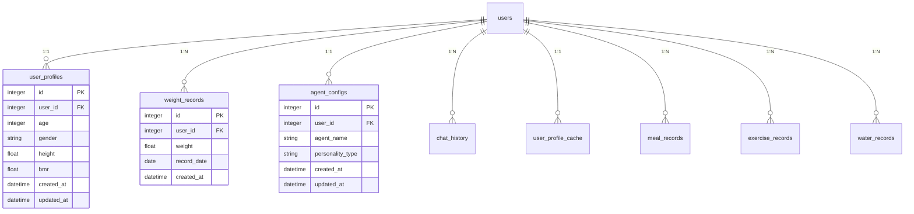

# 数据库结构文档

## 概述

体重管理助手使用SQLite数据库，通过SQLAlchemy ORM进行数据管理。数据库在应用启动时自动创建。

## 数据库初始化

### 自动初始化
当启动应用时，数据库会自动创建：
```bash
python main.py
```

### 手动初始化
如果需要手动初始化数据库：
```bash
python scripts/init_database.py
```

## 表结构

### 1. 用户表 (users)
| 字段名 | 类型 | 说明 |
|--------|------|------|
| id | Integer | 主键，自增 |
| openid | String(64) | 微信OpenID |
| nickname | String(100) | 用户昵称 |
| avatar_url | String(500) | 头像URL |
| created_at | DateTime | 创建时间 |
| last_login | DateTime | 最后登录时间 |

### 2. 用户档案表 (user_profiles)
| 字段名 | 类型 | 说明 |
|--------|------|------|
| id | Integer | 主键，自增 |
| user_id | Integer | 外键，关联users.id |
| age | Integer | 年龄 |
| gender | String(10) | 性别 (male/female) |
| height | Float | 身高 (cm) |
| bmr | Float | 基础代谢率 |
| activity_level | String(20) | 活动水平 |
| target_weight | Float | 目标体重 |
| created_at | DateTime | 创建时间 |
| updated_at | DateTime | 更新时间 |

### 3. 体重记录表 (weight_records)
| 字段名 | 类型 | 说明 |
|--------|------|------|
| id | Integer | 主键，自增 |
| user_id | Integer | 外键，关联users.id |
| weight | Float | 体重 (kg) |
| body_fat | Float | 体脂率 (%) |
| record_date | Date | 记录日期 |
| note | Text | 备注 |
| created_at | DateTime | 创建时间 |

### 4. Agent配置表 (agent_configs)
| 字段名 | 类型 | 说明 |
|--------|------|------|
| id | Integer | 主键，自增 |
| user_id | Integer | 外键，关联users.id |
| agent_name | String(50) | 助手名称 |
| personality_type | String(20) | 性格类型 (professional/warm/energetic) |
| created_at | DateTime | 创建时间 |
| updated_at | DateTime | 更新时间 |

### 5. 聊天历史表 (chat_history)
| 字段名 | 类型 | 说明 |
|--------|------|------|
| id | Integer | 主键，自增 |
| user_id | Integer | 外键，关联users.id |
| message | Text | 消息内容 |
| is_user | Boolean | 是否用户消息 |
| created_at | DateTime | 创建时间 |

### 6. 系统提示表 (system_prompts)
| 字段名 | 类型 | 说明 |
|--------|------|------|
| id | Integer | 主键，自增 |
| name | String(100) | 提示名称 |
| content | Text | 提示内容 |
| category | String(50) | 分类 |
| is_active | Boolean | 是否激活 |
| created_at | DateTime | 创建时间 |

### 7. 用户画像缓存表 (user_profile_cache)
| 字段名 | 类型 | 说明 |
|--------|------|------|
| id | Integer | 主键，自增 |
| user_id | Integer | 外键，关联users.id |
| cached_data | JSON | 缓存数据 |
| data_version | DateTime | 数据版本 |
| updated_at | DateTime | 更新时间 |

### 8. 餐食记录表 (meal_records)
| 字段名 | 类型 | 说明 |
|--------|------|------|
| id | Integer | 主键，自增 |
| user_id | Integer | 外键，关联users.id |
| meal_type | String(20) | 餐食类型 |
| food_name | String(200) | 食物名称 |
| calories | Float | 卡路里 |
| protein | Float | 蛋白质 |
| carbs | Float | 碳水化合物 |
| fat | Float | 脂肪 |
| record_date | Date | 记录日期 |
| created_at | DateTime | 创建时间 |

### 9. 运动记录表 (exercise_records)
| 字段名 | 类型 | 说明 |
|--------|------|------|
| id | Integer | 主键，自增 |
| user_id | Integer | 外键，关联users.id |
| exercise_type | String(100) | 运动类型 |
| duration | Integer | 时长 (分钟) |
| calories_burned | Float | 消耗卡路里 |
| intensity | String(20) | 强度 |
| record_date | Date | 记录日期 |
| created_at | DateTime | 创建时间 |

### 10. 饮水记录表 (water_records)
| 字段名 | 类型 | 说明 |
|--------|------|------|
| id | Integer | 主键，自增 |
| user_id | Integer | 外键，关联users.id |
| amount | Float | 饮水量 (ml) |
| record_date | Date | 记录日期 |
| created_at | DateTime | 创建时间 |

## 索引

1. **用户相关索引**:
   - `idx_users_openid`: users(openid)
   - `idx_user_profiles_user_id`: user_profiles(user_id)
   - `idx_weight_records_user_date`: weight_records(user_id, record_date)

2. **时间相关索引**:
   - `idx_chat_history_user_time`: chat_history(user_id, created_at)
   - `idx_meal_records_user_date`: meal_records(user_id, record_date)

## 数据关系



## 初始化数据

应用启动时会自动创建以下初始数据：

1. **系统提示**:
   - 专业型助手提示
   - 温暖型助手提示  
   - 活泼型助手提示

2. **默认配置**:
   - 默认助手名称: "小助"
   - 默认助手风格: "warm" (温暖型)

## 数据库维护

### 备份
```bash
# 手动备份数据库
cp weight_management.db weight_management_backup_$(date +%Y%m%d).db
```

### 清理
```bash
# 清理旧数据（通过应用内功能）
python scripts/cleanup_old_data.py
```

### 迁移
```bash
# 数据库迁移脚本
python scripts/migrate_database.py
```

## 注意事项

1. **数据库文件**: `weight_management.db` 在 `.gitignore` 中排除，不会提交到版本控制
2. **自动创建**: 首次运行应用时会自动创建数据库
3. **数据安全**: 用户敏感数据应加密存储
4. **备份策略**: 建议定期备份数据库文件